# 🍔 Restaurant Food App - Backend API

<div align="center">


*A comprehensive backend API for managing restaurants, food items, orders, and user authentication in a food delivery ecosystem.*

</div>

---

## 📑 Table of Contents

- [🎯 Project Overview](#-project-overview)
- [🏗️ System Architecture](#️-system-architecture)
- [🛠️ Technology Stack](#️-technology-stack)
- [📊 Database Design](#-database-design)
- [🔌 API Endpoints](#-api-endpoints)
- [🔐 Authentication Flow](#-authentication-flow)
- [📦 Order Management](#-order-management)
- [🚀 Quick Start](#-quick-start)
- [📋 Installation Guide](#-installation-guide)
- [🧪 Testing](#-testing)
- [📚 Documentation](#-documentation)
- [🔧 Configuration](#-configuration)
- [🏃 Running the Application](#-running-the-application)
- [🐛 Troubleshooting](#-troubleshooting)
- [🤝 Contributing](#-contributing)
- [📞 Support & Contact](#-support--contact)
- [📄 License](#-license)
- [🌟 Acknowledgments](#-acknowledgments)

---

## 🎯 Project Overview

The Restaurant Food App is a full-featured backend API designed to power modern food delivery and restaurant management applications. It provides a robust, scalable, and secure foundation for developers to build client-facing applications, such as mobile apps for customers, web dashboards for restaurant owners, and administrative panels for system operators.

This project handles the core logic of a food delivery service, including user registration, restaurant and menu management, order processing, and payment tracking. By providing a clear and well-documented API, it abstracts the backend complexity, allowing frontend developers to focus on creating a great user experience.

```mermaid
mindmap
  root((Restaurant Food App))
    Core Features
      🍽️ Food Management
        CRUD Operations
        Restaurant Filtering
        Category Organization
      👥 User Management
        Registration/Login
        Role-based Access
        Profile Management
      🛒 Order System
        Cart Management
        Status Tracking
        Payment Integration
    User Roles
      🛡️ Admin
        System Management
        User Oversight
        Analytics
      🏪 Restaurant Owner
        Menu Management
        Order Processing
        Restaurant Info
      👤 Customer
        Browse & Order
        Track Delivery
        Account Management
    Technical Stack
      ⚡ Backend
        Node.js Runtime
        Express.js Framework
        MongoDB Database
      🔐 Security
        JWT Authentication
        Password Hashing
        Input Validation
```



### 🌟 Key Features

- **Complete CRUD Operations** for foods, restaurants, categories, and users.
- **Advanced Authentication** with JSON Web Tokens (JWT) and role-based access control.
- **Comprehensive Order Management System** with real-time status updates from placement to delivery.
- **Dynamic Restaurant Filtering** and food categorization for easy browsing.
- **Secure Password Handling** using modern `bcrypt` hashing algorithms.
- **Robust Error Handling** with descriptive messages and standard HTTP status codes.
- **RESTful API Design** following industry best practices for predictability and ease of use.
- **Flexible MongoDB Integration** with Mongoose ODM for schema definition and validation.
- **Extensive Testing Suite** with Postman collections for manual and automated API validation.

---

## 🏗️ System Architecture

Our system is designed with a layered architecture to ensure separation of concerns, scalability, and maintainability. Each layer has a distinct responsibility, from handling raw HTTP requests to interacting with the database.

### High-Level Architecture Overview

The diagram below illustrates the major components of the system and how they interact.


-   **Client Layer**: Represents the various frontend applications that consume our API. This can include customer-facing mobile/web apps, restaurant management panels, and admin dashboards.
-   **API Gateway**: The entry point for all client requests. The Express.js server, along with its middleware, handles routing, security (CORS, Authentication), and logging before passing the request to the appropriate controller.
-   **Business Logic Layer**: This is where the core application logic resides. Controllers receive requests, validate inputs, and orchestrate the necessary operations to fulfill the request.
-   **Data Access Layer (DAL)**: This layer abstracts the database interactions. We use Mongoose as an Object-Document Mapper (ODM) to define schemas (Models) and interact with MongoDB in a structured way.
-   **Database Layer**: The persistence layer where all application data is stored. We use MongoDB, a NoSQL document database, which provides flexibility and scalability.

### Request Flow Architecture

This sequence diagram shows the journey of a single HTTP request through the system, from the client to the database and back.

```mermaid
sequenceDiagram
    participant Client as 📱 Client App
    participant Middleware as 🔒 Middleware Stack
    participant Controller as 🎮 Controller
    participant Model as 📊 Mongoose Model
    participant Database as 🗄️ MongoDB
    
    Note over Client,Database: Complete Request Lifecycle
    
    Client->>Middleware: HTTP Request
    Middleware->>Middleware: CORS Check & Body Parsing
    
    alt Protected Route
        Middleware->>Middleware: JWT Validation
        Middleware->>Controller: Authenticated Request
    else Public Route
        Middleware->>Controller: Direct Request
    end
    
    Controller->>Controller: Input Validation & Business Logic
    Controller->>Model: Database Operation (e.g., find, create)
    Model->>Database: Query Execution
    Database-->>Model: Query Result
    Model-->>Controller: Processed Data
    
    alt Success
        Controller->>Client: 200/201 Success Response
    else Error
        Controller->>Client: 4xx/5xx Error Response
    end
```



The flow demonstrates how middleware acts as a gatekeeper, performing checks before the controller handles the core logic. The controller then uses the model to perform database operations, and finally, a response is sent back to the client.

---

## 🛠️ Technology Stack

We've chosen a modern, robust, and widely-supported technology stack based on JavaScript, Node.js, and MongoDB.

### Core Technologies


### Why this stack?

-   **Node.js & Express.js**: Provide a fast, non-blocking I/O model that is perfect for data-intensive, real-time applications. Express.js simplifies API development with its minimalist and flexible framework.
-   **MongoDB & Mongoose**: A NoSQL document database like MongoDB offers great flexibility for evolving data structures. Mongoose adds a layer of structure with schemas, validation, and business logic hooks, giving us the best of both worlds.
-   **JWT & bcryptjs**: For security, JWT provides a stateless, token-based authentication mechanism ideal for RESTful APIs. We never store plain-text passwords; instead, we use `bcryptjs` to hash them securely.

### Dependencies Overview

| Category         | Technology     | Purpose                        | Version  |
| ---------------- | -------------- | ------------------------------ | -------- |
| **Runtime**      | Node.js        | JavaScript runtime environment | 18+      |
| **Framework**    | Express.js     | Web application framework      | ^4.18.0  |
| **Database**     | MongoDB        | NoSQL document database        | Latest   |
| **ODM**          | Mongoose       | MongoDB object modeling        | ^7.0.0   |
| **Authentication** | jsonwebtoken   | JWT token handling             | ^9.0.0   |
| **Security**     | bcryptjs       | Password hashing               | ^2.4.3   |
| **Middleware**   | cors           | Cross-Origin Resource Sharing  | ^2.8.5   |
| **Logging**      | morgan         | HTTP request logging           | ^1.10.0  |
| **Environment**  | dotenv         | Environment variable loading   | ^16.0.0  |
| **Development**  | nodemon        | Development auto-restart       | ^2.0.20  |

---

## 📊 Database Design

The database schema is designed to be efficient and scalable, capturing all the necessary relationships between users, restaurants, foods, and orders.

### Entity Relationship Diagram (ERD)

This diagram visualizes the database collections (entities) and the relationships between them.


### Data Models Explained

-   **User**: Stores information about all users, including customers, restaurant owners, and admins. The `userType` field is crucial for role-based access control.
-   **Restaurant**: Contains details about each restaurant, such as its name, location, and operating hours. It's linked to a `User` (the owner).
-   **Food**: Represents an individual food item on a menu. It's linked to a `Restaurant` and a `Category`.
-   **Category**: Helps organize food items (e.g., "Pizza", "Desserts", "Drinks").
-   **Order**: Tracks an order placed by a `User`. It contains a list of `Food` items, the total payment, and the current `status` of the order.

---

## 🔌 API Endpoints

The API is structured around REST principles, with predictable, resource-oriented URLs.

### API Overview Mind Map


### Detailed Endpoint Specifications

#### 🔐 Authentication Endpoints (`/api/v1/auth`)

| Method | Endpoint    | Description       | Auth Required |
| ------ | ----------- | ----------------- | ------------- |
| `POST` | `/register` | User registration | ❌ No         |
| `POST` | `/login`    | User login        | ❌ No         |

#### 👥 User Management Endpoints (`/api/v1/user`)

| Method   | Endpoint           | Description         | Auth Required | Role(s)      |
| -------- | ------------------ | ------------------- | ------------- | ------------ |
| `GET`    | `/getUser`         | Get user profile    | ✅ Yes        | All          |
| `PUT`    | `/updateUser`      | Update user profile | ✅ Yes        | All          |
| `PUT`    | `/updatePassword`  | Change password     | ✅ Yes        | All          |
| `DELETE` | `/deleteUser/:id`  | Delete account      | ✅ Yes        | Admin, Owner |

#### 🏪 Restaurant Management Endpoints (`/api/v1/restaurant`)

| Method   | Endpoint        | Description          | Auth Required | Role(s) |
| -------- | --------------- | -------------------- | ------------- | ------- |
| `POST`   | `/create`       | Create restaurant    | ✅ Yes        | Admin   |
| `GET`    | `/getAll`       | Get all restaurants  | ❌ No         | -       |
| `GET`    | `/get/:id`      | Get restaurant by ID | ❌ No         | -       |
| `DELETE` | `/delete/:id`   | Delete restaurant    | ✅ Yes        | Admin   |

#### 🍽️ Food & Order Endpoints (`/api/v1/food`)

| Method | Endpoint                  | Description             | Auth Required | Role(s)      |
| ------ | ------------------------- | ----------------------- | ------------- | ------------ |
| `POST` | `/create`                 | Create food item        | ✅ Yes        | Admin, Owner |
| `GET`  | `/getAll`                 | Get all foods           | ❌ No         | -            |
| `GET`  | `/getByRestaurant/:id`    | Get foods by restaurant | ❌ No         | -            |
| `PUT`  | `/update/:id`             | Update food item        | ✅ Yes        | Admin, Owner |
| `DELETE` | `/delete/:id`           | Delete food item        | ✅ Yes        | Admin, Owner |
| `POST` | `/placeorder`             | Place an order          | ✅ Yes        | Client       |
| `PUT`  | `/orderStatus/:id`        | Update order status     | ✅ Yes        | Admin, Owner |

---

## 🔐 Authentication Flow

Security is paramount. Our authentication flow uses JWT for stateless, secure access to protected resources.

### JWT Authentication Process

The process begins with registration and login, where a user receives a JWT. This token must then be included in the header of all subsequent requests to protected endpoints.

```mermaid
sequenceDiagram
    participant User as 👤 User
    participant Client as 📱 Client App
    participant API as 🔧 API Server
    participant Auth as 🔐 Auth Service
    participant DB as 🗄️ Database
    
    Note over User,DB: User Login Flow
    User->>Client: Enter Login Credentials
    Client->>API: POST /api/v1/auth/login
    API->>DB: Find User by Email
    
    alt User Found
        DB-->>API: User Data (with hashed password)
        API->>Auth: Compare Plain Password with Hash
        
        alt Password Valid
            Auth-->>API: Password Match
            API->>Auth: Generate JWT Token (with user ID & role)
            Auth-->>API: JWT Token
            API-->>Client: 200 OK + { token: "...", user: {...} }
            Client->>Client: Store JWT Token securely
        else Password Invalid
            Auth-->>API: Password Mismatch
            API-->>Client: 401 Unauthorized - Invalid Credentials
        end
    else User Not Found
        DB-->>API: No User Found
        API-->>Client: 404 Not Found - User not found
    end
```



### Token Validation Middleware

For every request to a protected route, our authentication middleware automatically validates the JWT.

```mermaid

flowchart TD
    A[Incoming Request to Protected Route] --> B{Has Authorization Header}
    B -->|No| C[Reject with 401 Unauthorized]
    B -->|Yes| D[Extract Token]
    D --> E[Verify Token Signature using JWT_SECRET]
    E -->|Invalid or Expired| F[Reject with 401 Unauthorized]
    E -->|Valid| G[Decode Payload - userID and role]
    G --> H[Attach user info to req.user]
    H --> I[Proceed to Controller via next()]

    style C fill:#ffcdd2
    style F fill:#ffcdd2
    style I fill:#c8e6c9


```

---

## 📦 Order Management

The order management system is the heart of the application, tracking an order from creation to completion.

### Order Lifecycle State Machine

This state diagram illustrates the possible states of an order and the transitions between them.


### Order Processing Flow

This sequence diagram details the interactions between all parties during the order process.

```mermaid
sequenceDiagram
    participant Customer as 👤 Customer
    participant API as 🔧 API Server
    participant Restaurant as 🏪 Restaurant
    participant DB as 🗄️ Database
    
    Customer->>API: POST /api/v1/food/placeorder (with JWT)
    API->>API: Validate cart & calculate total
    API->>DB: Create Order (status: "Pending")
    API-->>Customer: 201 Created - Order placed
    API->>Restaurant: 📧 Notification: New Order
    
    Restaurant->>API: PUT /api/v1/food/orderStatus/:id (status: "Confirmed")
    API->>DB: Update Order status
    API-->>Customer: 📱 Notification: Order Confirmed
    
    Restaurant->>API: PUT /api/v1/food/orderStatus/:id (status: "Preparing")
    API->>DB: Update Order status
    API-->>Customer: 📱 Notification: Your food is being prepared
    
    Restaurant->>API: PUT /api/v1/food/orderStatus/:id (status: "OutForDelivery")
    API->>DB: Update Order status
    API-->>Customer: 📱 Notification: Your order is on the way!
    
    Restaurant->>API: PUT /api/v1/food/orderStatus/:id (status: "Delivered")
    API->>DB: Update Order status
    API-->>Customer: 📱 Notification: Enjoy your meal!
```



---

## 🚀 Quick Start

Get the server up and running on your local machine in minutes.

### Prerequisites Checklist

Make sure you have the following tools installed before you begin.


### 30-Second Setup

```bash
# 1. Clone the repository
git clone https://github.com/your-username/your-repo-name.git
cd your-repo-name

# 2. Install dependencies
npm install

# 3. Setup environment variables
# Create a .env file from the example
cp .env.example .env
# Open .env and add your MongoDB URI and a JWT secret

# 4. Ensure your MongoDB server is running
# (e.g., by running `mongod` in a separate terminal)

# 5. Run the application in development mode
npm run dev

# Your API should now be running at http://localhost:8080
```

---

## 📋 Installation Guide

Follow these detailed steps for a complete setup from scratch.

### Step-by-Step Installation Process

```mermaid
flowchart TD
    A[Start] --> B{Check Prerequisites};
    B --> C{Node.js & MongoDB Installed?};
    C -->|No| D[Install Node.js & MongoDB];
    C -->|Yes| E[Clone Repository from Git];
    D --> E;
    E --> F[Navigate to Project Directory];
    F --> G[Run `npm install`];
    G --> H[Create `.env` file from `.env.example`];
    H --> I[Configure `MONGO_URI` and `JWT_SECRET` in `.env`];
    I --> J[Start MongoDB Service];
    J --> K[Run `npm run dev` to start the server];
    K --> L[✅ Setup Complete!];
    
    style L fill:#c8e6c9;
```



### Detailed Steps

1.  **Clone the Repository**:
    ```bash
    git clone https://github.com/your-username/your-repo-name.git
    cd your-repo-name
    ```

2.  **Install Dependencies**: This command installs all the packages listed in `package.json`.
    ```bash
    npm install
    ```

3.  **Configure Environment**: Your application's configuration is stored in environment variables.
    ```bash
    # Create a .env file by copying the template
    cp .env.example .env
    ```
    Now, open the newly created `.env` file and set the following variables:
    ```env
    # Server Port
    PORT=8080

    # Your MongoDB connection string
    MONGO_URI=mongodb://localhost:27017/restaurant_food_app

    # A long, random, and secret string for signing JWTs
    JWT_SECRET=your_super_secret_jwt_key_here
    ```

4.  **Run the Application**: This command starts the server using `nodemon`, which will automatically restart the server whenever you make changes to the code.
    ```bash
    npm run dev
    ```
    You should see the following output in your terminal:
    ```
    🚀 Server running on port 8080
    📊 MongoDB connected successfully
    ```

---

## 🧪 Testing

We use Postman for manual API testing and Newman for automated integration testing. A Postman collection is included in the `/postman` directory.

### Testing Strategy

Our strategy covers manual and automated testing to ensure API reliability.


### Running Tests with Newman

Newman is a command-line runner for Postman collections. It allows you to run your tests from the terminal, making it ideal for automation.

1.  **Install Newman**:
    ```bash
    npm install -g newman
    ```

2.  **Run the Collection**: Execute the following command from the project root to run all tests.
    ```bash
    # Make sure to have your server running first!
    newman run postman/collection.json --environment postman/environment.json
    ```

---

## 🤝 Contributing

We welcome contributions from the community! Please follow these guidelines to contribute.

### Contribution Workflow

```mermaid
gitgraph
    commit id: "Initial commit"
    branch feature/new-endpoint
    checkout feature/new-endpoint
    commit id: "feat: add new endpoint structure"
    commit id: "test: add unit tests for endpoint"
    checkout main
    merge feature/new-endpoint
    commit id: "Merge new endpoint"
    branch hotfix/auth-bug
    checkout hotfix/auth-bug
    commit id: "fix: resolve authentication bug"
    checkout main
    merge hotfix/auth-bug
```

1.  **Fork** the repository.
2.  Create a new **branch** for your feature (`git checkout -b feature/your-feature-name`).
3.  Make your changes and **commit** them with a descriptive message.
4.  **Push** your branch to your fork (`git push origin feature/your-feature-name`).
5.  Open a **Pull Request** to the `main` branch of the original repository.

---

## 📞 Support & Contact

If you encounter a bug or have a feature request, please use the GitHub Issues tab.

### Issue Reporting

```mermaid
flowchart LR
    A[Have an Issue?] --> B{Is it a Bug or a Feature Request?};
    B -->|Bug 🐛| C[Create a New Issue];
    B -->|Feature ✨| D[Create a New Issue];
    C --> E[Provide steps to reproduce, logs, and screenshots];
    D --> F[Describe the feature and its use case];
```



---

## 📄 License

This project is licensed under the MIT License. See the [LICENSE](LICENSE) file for details.

---

## 🌟 Acknowledgments

-   To all the creators of the open-source packages used in this project.
-   To the developer community for continuous inspiration and support.

---

<div align="center">

### 🚀 Ready to Start Building?

[Get Started](#-quick-start) | [Contribute](#-contributing)

**Happy Coding! 🎉**

</div>
