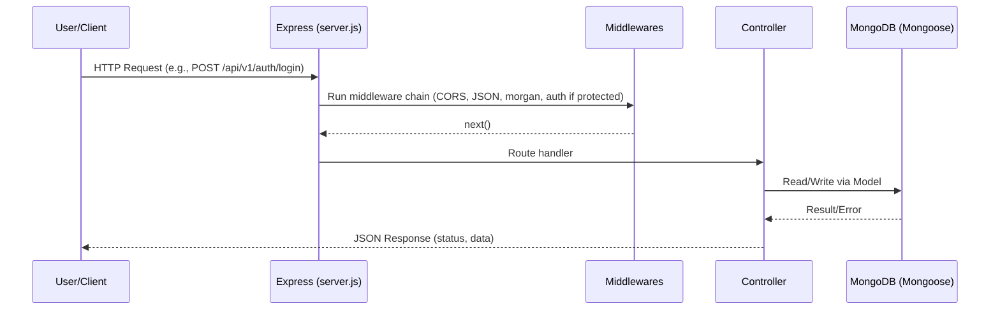
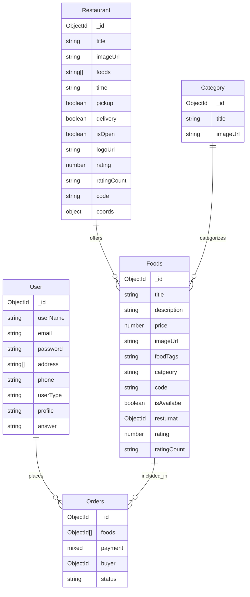
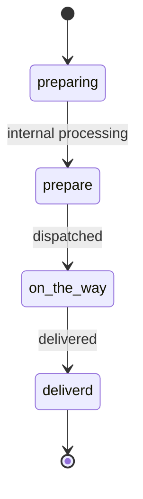

# Restaurant Food App — Backend Documentation

This document describes the complete backend of the Restaurant Food App. It covers the project structure, environment, dependencies, data models, controllers, routes, middleware, authentication, order flow, error handling, and operational guidance. Diagrams are included using Mermaid for architecture and request flows.

- Source root: /
- Express server entry: [server.js](server.js)
- Environment: [.env](.env) (example: [.env.example](.env.example))
- Database connection: [config/db.js](config/db.js)
- Models: [models](models/)
- Controllers: [controllers](controllers/)
- Routes: [routes](routes/)
- Middleware: [middlewares](middlewares/)
- Docs: [docs](docs/)

---

## Table of Contents

- Overview
- Architecture and Flow
- Environment Variables
- Dependencies
- Project Structure
- Data Models
- Controllers and Business Logic
- Routing
- Middleware
- Authentication and Authorization
- Orders and Payments
- Error Handling and Logging
- CORS and Security
- Running Locally
- API Reference (Selected)
- Known Issues and Recommendations
- Contributing

---

## Overview

This is a Node.js + Express REST API for a food ordering platform with users, restaurants, foods, categories, and orders. MongoDB (via Mongoose) is used for persistence. JWT is used for authentication. The API supports typical CRUD for resources and order placement and status management.

---

## Architecture and Flow

```mermaid
flowchart TD
  Client[Client Apps (Web/Mobile)] --> API[Express API (server.js)]
  API -->|DB Connect| DB[(MongoDB)]
  subgraph API Modules
    R[Routes]
    C[Controllers]
    M[Middlewares]
    MD[Models]
    CFG[Config]
  end

  API --> R
  R --> M
  R --> C
  C --> MD
  CFG --> API
  CFG --> MD

  subgraph Security
    JWT[JWT Handling]
  end

  M --> JWT
  JWT --> C
```

Request lifecycle:



---

## Environment Variables

- MONGO_URL: MongoDB connection string (used in [config/db.js](config/db.js))
- PORT: Server port (default 8080) (used in [server.js](server.js))
- JWT_SECRET: Secret for JWT verification/signing (used at least in [`middlewares/authMiddleware`](middlewares/authMiddleware.js) and auth controller)

Example .env:

```bash
MONGO_URL=mongodb://localhost:27017/restaurant_food_app
PORT=8080
JWT_SECRET=your-very-secure-secret
```

---

## Dependencies

Runtime:
- express: Web framework to define routes, middleware, and server ([server.js](server.js))
- mongoose: ODM for MongoDB ([config/db.js](config/db.js), Models in [models](models/))
- cors: Enables CORS for cross-origin requests ([server.js](server.js))
- morgan: HTTP request logger middleware ([server.js](server.js))
- dotenv: Loads environment vars from .env ([server.js](server.js))
- colors: Console logging colors for better visibility ([config/db.js](config/db.js), [server.js](server.js))
- bcryptjs: Password hashing ([`controllers/auth.controllers`](controllers/auth.controllers.js))
- jsonwebtoken: JWT token signing/verification ([`controllers/auth.controllers`](controllers/auth.controllers.js), [`middlewares/authMiddleware`](middlewares/authMiddleware.js))

Dev/Tooling:
- VS Code workspace settings in [.vscode/settings.json](.vscode/settings.json) (if present)

Usage patterns:
- Express initializes app, attaches middleware, and mounts route modules.
- Mongoose connects once on startup and models define schemas/validation.
- CORS is global to allow clients (web/mobile) to consume API.
- Morgan logs incoming requests.
- Dotenv provides config separation.
- bcryptjs hashes passwords before persistence.
- jsonwebtoken secures protected endpoints via Authorization: Bearer flow.

---

## Project Structure

```
.env
.env.example
.gitignore
data.js
package.json
server.js
.vscode/
  settings.json
config/
  db.js
controllers/
  auth.controllers.js
  category.controllers.js
  food.controllers.js
  resturant.controllers.js
  test.controllers.js
  user.controllers.js
data/
docs/
  diagrams.md
  documentation.md   <-- this file
  project_roadmap1.md
  project_roadmap2.md
  testing.md
  user_guide_detailed.md
  user_guide.md
middlewares/
  adminMiddleware.js
  authMiddleware.js
models/
  category.models.js
  food.models.js
  order.models.js
  resturant.models.js
  users.models.js
routes/
  auth.routes.js
  category.routes.js
  food.routes.js
  resturant.routes.js
  test.routes.js
  user.routes.js
utils/
```

---

## Data Models

All models are Mongoose schemas.

- User: [models/users.models.js](models/users.models.js)
  - Fields: userName, email (unique), password, address [String], phone, userType (enum: admin|client|vendor|driver, default client), profile (default avatar), answer, timestamps
  - Export: model("User", userSchema)

- Restaurant: [models/resturant.models.js](models/resturant.models.js)
  - Fields: title, imageUrl, foods [Array], time, pickup, delivery, isOpen, logoUrl, rating (1–5), ratingCount, code (unique), coords (id, latitude, latitudeDelta, longitude, longitudeDelta, address, title), timestamps
  - Export: model("Restaurant", restaurantSchema)

- Category: [models/category.models.js](models/category.models.js)
  - Fields: title (required), imageUrl (default), timestamps
  - Export: model("Category", categorySchema)

- Food: [models/food.models.js](models/food.models.js)
  - Fields: title, description, price, imageUrl (default), foodTags, catgeory, code, isAvailabe, resturnat (ObjectId ref "Resturant"), rating (1–5), ratingCount, timestamps
  - Export: model("Foods", foodSchema)

- Order: [models/order.models.js](models/order.models.js)
  - Fields: foods [ObjectId ref "Foods"], payment (mixed), buyer (ObjectId ref "User"), status (enum: preparing|prepare|on the way|deliverd; default preparing), timestamps
  - Export: model("Orders", ordersSchema)

Entity Relationships:



Notes:
- Food.resturnat ref is "Resturant" but Restaurant model name is "Restaurant". This mismatch prevents population (see Known Issues).
- Order.status has typos in enum.

---

## Controllers and Business Logic

Auth: [controllers/auth.controllers.js](controllers/auth.controllers.js)
- [`registerController`](controllers/auth.controllers.js): Validates user fields, checks existing user by email, hashes password (bcrypt), creates user, returns user data (currently includes password in response; see Known Issues).
- [`loginController`](controllers/auth.controllers.js): Validates input, finds user by email, compares password, issues JWT on success (implementation extends beyond the excerpt).

User: [controllers/user.controllers.js](controllers/user.controllers.js)
- [`getUserController`](controllers/user.controllers.js): Uses `req.user.id` from auth middleware, returns user without password.
- [`updateUserController`](controllers/user.controllers.js): Updates userName/phone/address on the authenticated user.
- [`updatePasswordController`](controllers/user.controllers.js): Not shown in snippet but wired in routes; generally validates current password, sets new hash.
- [`resetPasswordController`](controllers/user.controllers.js): Not shown; typically uses a security answer (answer field exists in user).
- [`deleteProfileController`](controllers/user.controllers.js): Not shown; deletes user account.

Restaurant: [controllers/resturant.controllers.js](controllers/resturant.controllers.js)
- [`createResturantController`](controllers/resturant.controllers.js): Validates title and coords, saves new restaurant.
- [`getAllResturantController`](controllers/resturant.controllers.js): Returns list and count.
- [`getResturantByIdController`](controllers/resturant.controllers.js): Validates id param, returns single.
- [`deleteResturantController`](controllers/resturant.controllers.js): Validates id, deletes.

Category: [controllers/category.controllers.js](controllers/category.controllers.js)
- [`createCatController`](controllers/category.controllers.js): Validates title, creates category.
- [`getAllCatController`](controllers/category.controllers.js): Lists categories.
- [`updateCatController`](controllers/category.controllers.js): Updates by id; expects title, imageUrl.
- [`deleteCatController`](controllers/category.controllers.js): Deletes by id.

Food: [controllers/food.controllers.js](controllers/food.controllers.js)
- [`createFoodController`](controllers/food.controllers.js): Validates required fields, creates food item.
- [`getAllFoodsController`](controllers/food.controllers.js): Lists foods.
- [`getSingleFoodController`](controllers/food.controllers.js): Retrieves by id.
- [`getFoodByResturantController`](controllers/food.controllers.js): Lists by restaurant id.
- [`updateFoodController`](controllers/food.controllers.js): Updates fields by id.
- [`deleteFoodController`](controllers/food.controllers.js): Deletes by id.
- [`placeOrderController`](controllers/food.controllers.js): Validates `cart` array, computes total, maps items to IDs, creates order with foods and buyer (currently uses req.body.id; see Known Issues).
- [`orderStatusController`](controllers/food.controllers.js): Updates status by order id.

Test: [controllers/test.controllers.js](controllers/test.controllers.js)
- [`testUserController`](controllers/test.controllers.js): Health/test endpoint for connectivity.

---

## Routing

Mounted in [server.js](server.js):

- /api/v1/test → [routes/test.routes.js](routes/test.routes.js)
  - GET /test-user → [`testUserController`](controllers/test.controllers.js)

- /api/v1/auth → [routes/auth.routes.js](routes/auth.routes.js)
  - POST /register → [`registerController`](controllers/auth.controllers.js)
  - POST /login → [`loginController`](controllers/auth.controllers.js)

- /api/v1/user → [routes/user.routes.js](routes/user.routes.js)
  - GET /getUser (auth) → [`getUserController`](controllers/user.controllers.js)
  - PUT /updateUser (auth) → [`updateUserController`](controllers/user.controllers.js)
  - POST /updatePassword (auth) → [`updatePasswordController`](controllers/user.controllers.js)
  - POST /resetPassword (auth) → [`resetPasswordController`](controllers/user.controllers.js)
  - DELETE /deleteUser (auth) → [`deleteProfileController`](controllers/user.controllers.js)

- /api/v1/resturant → [routes/resturant.routes.js](routes/resturant.routes.js)
  - POST /create (auth) → [`createResturantController`](controllers/resturant.controllers.js)
  - GET /getAll → [`getAllResturantController`](controllers/resturant.controllers.js)
  - GET /get/:id → [`getResturantByIdController`](controllers/resturant.controllers.js)
  - DELETE /delete/:id (auth) → [`deleteResturantController`](controllers/resturant.controllers.js)

- /api/v1/category → [routes/category.routes.js](routes/category.routes.js)
  - POST /create (auth) → [`createCatController`](controllers/category.controllers.js)
  - GET /getAll → [`getAllCatController`](controllers/category.controllers.js)
  - PUT /update/:id (auth) → [`updateCatController`](controllers/category.controllers.js)
  - DELETE /delete/:id (auth) → [`deleteCatController`](controllers/category.controllers.js)

- /api/v1/food → [routes/food.routes.js](routes/food.routes.js)
  - POST /create (auth) → [`createFoodController`](controllers/food.controllers.js)
  - GET /getAll → [`getAllFoodsController`](controllers/food.controllers.js)
  - GET /get/:id → [`getSingleFoodController`](controllers/food.controllers.js)
  - GET /getByResturant/:id → [`getFoodByResturantController`](controllers/food.controllers.js)
  - PUT /update/:id (auth) → [`updateFoodController`](controllers/food.controllers.js)
  - DELETE /delete/:id (auth) → [`deleteFoodController`](controllers/food.controllers.js)
  - POST /placeorder (auth) → [`placeOrderController`](controllers/food.controllers.js)
  - POST /orderStatus/:id (auth + admin) → [`orderStatusController`](controllers/food.controllers.js)

Note: [routes/catgeory.routes.js](routes/catgeory.routes.js) exists but is not used by [server.js](server.js). It also imports from a non-existing `controllers/categoryController`. See Known Issues.

---

## Middleware

- Auth: [`middlewares/authMiddleware`](middlewares/authMiddleware.js)
  - Extracts Bearer token from Authorization header.
  - Verifies token with JWT_SECRET.
  - Sets `req.user = { id: decoded.id }` on success.
  - Returns 401 Unauthorized on invalid token, 500 if header missing/malformed.

- Admin: [`middlewares/adminMiddleware`](middlewares/adminMiddleware.js)
  - Loads user by req.body.id and checks usertype === "admin".
  - On success calls next(), else 401.
  - See Known Issues: should rely on `req.user.id`, and User schema field is `userType` not `usertype`.

Request flow for protected endpoints:

```mermaid
flowchart LR
  A[Client Request] --> B{Has Authorization: Bearer <token>?}
  B -- No --> X[401 Unauthorized]
  B -- Yes --> C[authMiddleware JWT.verify]
  C -- Invalid --> X[401 Unauthorized]
  C -- Valid --> D[req.user = {id}]
  D --> E[Controller handler]
  E --> R[Response]
```

---

## Authentication and Authorization

- Registration:
  - Path: POST /api/v1/auth/register
  - Hashing: bcryptjs with salt rounds 10 in [`registerController`](controllers/auth.controllers.js)
  - Note: Current response includes hashed password (should be removed).

- Login:
  - Path: POST /api/v1/auth/login
  - Compares credentials, issues JWT.
  - JWT must be sent as Authorization: Bearer <token>.

- Protected Endpoints:
  - Use `authMiddleware` to enforce authentication.
  - For admin-only endpoints (e.g., order status), `adminMiddleware` is additionally applied.

---

## Orders and Payments

Order lifecycle:



Placement:
- [`placeOrderController`](controllers/food.controllers.js) expects `cart` array in body, sums prices, collects item ids as `foodIds`, and creates an `Orders` document with `foods`, `payment: total`, `buyer: req.body.id`.
- Recommendation: use `req.user.id` for buyer assignment rather than reading from body; validate item ids exist.

Order status update:
- [`orderStatusController`](controllers/food.controllers.js) updates `status` by `:id`.

---

## Error Handling and Logging

- Controllers catch exceptions and respond with 500 and an error message. Many also log with `console.log(error)`.
- DB connection logs success with colors formatting in [config/db.js](config/db.js).
- Request logs use morgan("dev") globally in [server.js](server.js).

---

## CORS and Security

- CORS enabled globally via `app.use(cors())` ([server.js](server.js)).
- JWT secret must be strong and private.
- Passwords are hashed with bcryptjs and should never be returned in responses (see Known Issues).
- Validate and sanitize input fields to mitigate injection and validation errors.
- Rate limiting and helmet are recommended additions for production.

---

## Running Locally

Install dependencies and start:

```bash
npm install
node server.js
# or if a start script exists:
npm run start
```

Ensure .env is configured with MONGO_URL, PORT, and JWT_SECRET before starting.

---

## API Reference (Selected)

Auth:

```http
POST /api/v1/auth/register
Content-Type: application/json

{
  "userName": "Alice",
  "email": "alice@example.com",
  "password": "Str0ngP@ss",
  "phone": "1234567890",
  "address": ["123 Main St"],
  "answer": "pet-name"
}
```

```http
POST /api/v1/auth/login
Content-Type: application/json

{ "email": "alice@example.com", "password": "Str0ngP@ss" }
```

Users:

```http
GET /api/v1/user/getUser
Authorization: Bearer <token>
```

```http
PUT /api/v1/user/updateUser
Authorization: Bearer <token>
Content-Type: application/json

{ "userName": "Alice B", "phone": "9876543210", "address": ["456 2nd St"] }
```

Restaurants:

```http
POST /api/v1/resturant/create
Authorization: Bearer <token>
Content-Type: application/json

{
  "title": "Pizza Hut",
  "imageUrl": "https://example.com/pizza.jpg",
  "time": "9am-9pm",
  "pickup": true,
  "delivery": true,
  "isOpen": true,
  "logoUrl": "https://example.com/logo.png",
  "rating": 4.5,
  "ratingCount": "100",
  "code": "PIZZAHUT001",
  "coords": {
    "id": "ph-1",
    "latitude": 12.34,
    "latitudeDelta": 0.01,
    "longitude": 56.78,
    "longitudeDelta": 0.01,
    "address": "Mumbai, India",
    "title": "Pizza Hut Mumbai"
  }
}
```

Categories:

```http
POST /api/v1/category/create
Authorization: Bearer <token>
Content-Type: application/json

{ "title": "Pizza", "imageUrl": "https://example.com/pizza-cat.png" }
```

Foods:

```http
POST /api/v1/food/create
Authorization: Bearer <token>
Content-Type: application/json

{
  "title": "Margherita",
  "description": "Classic pizza",
  "price": 9.99,
  "imageUrl": "https://example.com/margherita.jpg",
  "foodTags": "vegetarian",
  "catgeory": "Pizza",
  "code": "FOOD-001",
  "isAvailabe": true,
  "resturnat": "662e1c2b0f1a2a1234567890",
  "rating": 5
}
```

Orders:

```http
POST /api/v1/food/placeorder
Authorization: Bearer <token>
Content-Type: application/json

{
  "cart": [
    { "id": "662e1c2b0f1a2a1234567890", "price": 9.99 },
    { "id": "662e1c2b0f1a2a1234567891", "price": 5.75 }
  ]
}
```

---

## Known Issues and Recommendations

- Sensitive data in register response:
  - [`registerController`](controllers/auth.controllers.js) returns `password` in response.
  - Recommendation: Omit password from all responses.

- Admin middleware user lookup source and field name:
  - [`adminMiddleware`](middlewares/adminMiddleware.js) uses `req.body.id` and `user.usertype`.
  - Recommendation: Use `req.user.id` (set by auth middleware) and `user.userType` (schema field).

- Mongoose ref name mismatch:
  - [`food.models`](models/food.models.js) defines `resturnat` with ref "Resturant".
  - Restaurant model name is "Restaurant".
  - Recommendation: Fix ref to "Restaurant" and align field naming (typo: resturnat → restaurant).

- Order status typos:
  - [`order.models`](models/order.models.js) enum: "prepare" and "deliverd" likely should be "prepared" and "delivered".
  - Recommendation: Fix enum and update any logic/constants accordingly.

- Duplicate/misspelled category route:
  - [routes/catgeory.routes.js](routes/catgeory.routes.js) is unused and imports from non-existent controller.
  - Recommendation: Remove or fix, and ensure [server.js](server.js) mounts only the correct [routes/category.routes.js](routes/category.routes.js).

- Address data type consistency:
  - User.address is an array of strings; controllers sometimes treat address as a single string.
  - Recommendation: Standardize on array or change schema to string.

- Buyer assignment on order placement:
  - [`placeOrderController`](controllers/food.controllers.js) uses `req.body.id` for `buyer`.
  - Recommendation: Use `req.user.id` from JWT to prevent spoofing.

- Data seed types:
  - [data.js](data.js) coords use strings for lat/long; schema expects numbers.
  - Recommendation: Ensure type correctness if used as a seed.

---

## Running Tests and Debugging

- Test endpoint: GET /api/v1/test/test-user → [`testUserController`](controllers/test.controllers.js)
- Logs: Morgan (dev) for HTTP; console logs in controllers for errors.
- Use VS Code debugger to attach to Node.js for step-through in controllers and middleware.

---

## Contributing

- Follow existing code style.
- Add validation and DTOs for request bodies where needed.
- Update this documentation and [docs/diagrams.md](docs/diagrams.md) when introducing architectural changes.
- Write unit/integration tests for controllers and middleware.

---
```// filepath: d:\CODES\FullStack\Backend\Restaurant Food App\docs\documentation.md
# Restaurant Food App — Backend Documentation

This document describes the complete backend of the Restaurant Food App. It covers the project structure, environment, dependencies, data models, controllers, routes, middleware, authentication, order flow, error handling, and operational guidance. Diagrams are included using Mermaid for architecture and request flows.

- Source root: /
- Express server entry: [server.js](server.js)
- Environment: [.env](.env) (example: [.env.example](.env.example))
- Database connection: [config/db.js](config/db.js)
- Models: [models](models/)
- Controllers: [controllers](controllers/)
- Routes: [routes](routes/)
- Middleware: [middlewares](middlewares/)
- Docs: [docs](docs/)

---

## Table of Contents

- Overview
- Architecture and Flow
- Environment Variables
- Dependencies
- Project Structure
- Data Models
- Controllers and Business Logic
- Routing
- Middleware
- Authentication and Authorization
- Orders and Payments
- Error Handling and Logging
- CORS and Security
- Running Locally
- API Reference (Selected)
- Known Issues and Recommendations
- Contributing

---

## Overview

This is a Node.js + Express REST API for a food ordering platform with users, restaurants, foods, categories, and orders. MongoDB (via Mongoose) is used for persistence. JWT is used for authentication. The API supports typical CRUD for resources and order placement and status management.

---

## Architecture and Flow

```mermaid
flowchart TD
  Client[Client Apps (Web/Mobile)] --> API[Express API (server.js)]
  API -->|DB Connect| DB[(MongoDB)]
  subgraph API Modules
    R[Routes]
    C[Controllers]
    M[Middlewares]
    MD[Models]
    CFG[Config]
  end

  API --> R
  R --> M
  R --> C
  C --> MD
  CFG --> API
  CFG --> MD

  subgraph Security
    JWT[JWT Handling]
  end

  M --> JWT
  JWT --> C
```

Request lifecycle:


---

## Environment Variables

- MONGO_URL: MongoDB connection string (used in [config/db.js](config/db.js))
- PORT: Server port (default 8080) (used in [server.js](server.js))
- JWT_SECRET: Secret for JWT verification/signing (used at least in [`middlewares/authMiddleware`](middlewares/authMiddleware.js) and auth controller)

Example .env:

```bash
MONGO_URL=mongodb://localhost:27017/restaurant_food_app
PORT=8080
JWT_SECRET=your-very-secure-secret
```

---

## Dependencies

Runtime:
- express: Web framework to define routes, middleware, and server ([server.js](server.js))
- mongoose: ODM for MongoDB ([config/db.js](config/db.js), Models in [models](models/))
- cors: Enables CORS for cross-origin requests ([server.js](server.js))
- morgan: HTTP request logger middleware ([server.js](server.js))
- dotenv: Loads environment vars from .env ([server.js](server.js))
- colors: Console logging colors for better visibility ([config/db.js](config/db.js), [server.js](server.js))
- bcryptjs: Password hashing ([`controllers/auth.controllers`](controllers/auth.controllers.js))
- jsonwebtoken: JWT token signing/verification ([`controllers/auth.controllers`](controllers/auth.controllers.js), [`middlewares/authMiddleware`](middlewares/authMiddleware.js))

Dev/Tooling:
- VS Code workspace settings in [.vscode/settings.json](.vscode/settings.json) (if present)

Usage patterns:
- Express initializes app, attaches middleware, and mounts route modules.
- Mongoose connects once on startup and models define schemas/validation.
- CORS is global to allow clients (web/mobile) to consume API.
- Morgan logs incoming requests.
- Dotenv provides config separation.
- bcryptjs hashes passwords before persistence.
- jsonwebtoken secures protected endpoints via Authorization: Bearer flow.

---

## Project Structure

```
.env
.env.example
.gitignore
data.js
package.json
server.js
.vscode/
  settings.json
config/
  db.js
controllers/
  auth.controllers.js
  category.controllers.js
  food.controllers.js
  resturant.controllers.js
  test.controllers.js
  user.controllers.js
data/
docs/
  diagrams.md
  documentation.md   <-- this file
  project_roadmap1.md
  project_roadmap2.md
  testing.md
  user_guide_detailed.md
  user_guide.md
middlewares/
  adminMiddleware.js
  authMiddleware.js
models/
  category.models.js
  food.models.js
  order.models.js
  resturant.models.js
  users.models.js
routes/
  auth.routes.js
  category.routes.js
  food.routes.js
  resturant.routes.js
  test.routes.js
  user.routes.js
utils/
```

---

## Data Models

All models are Mongoose schemas.

- User: [models/users.models.js](models/users.models.js)
  - Fields: userName, email (unique), password, address [String], phone, userType (enum: admin|client|vendor|driver, default client), profile (default avatar), answer, timestamps
  - Export: model("User", userSchema)

- Restaurant: [models/resturant.models.js](models/resturant.models.js)
  - Fields: title, imageUrl, foods [Array], time, pickup, delivery, isOpen, logoUrl, rating (1–5), ratingCount, code (unique), coords (id, latitude, latitudeDelta, longitude, longitudeDelta, address, title), timestamps
  - Export: model("Restaurant", restaurantSchema)

- Category: [models/category.models.js](models/category.models.js)
  - Fields: title (required), imageUrl (default), timestamps
  - Export: model("Category", categorySchema)

- Food: [models/food.models.js](models/food.models.js)
  - Fields: title, description, price, imageUrl (default), foodTags, catgeory, code, isAvailabe, resturnat (ObjectId ref "Resturant"), rating (1–5), ratingCount, timestamps
  - Export: model("Foods", foodSchema)

- Order: [models/order.models.js](models/order.models.js)
  - Fields: foods [ObjectId ref "Foods"], payment (mixed), buyer (ObjectId ref "User"), status (enum: preparing|prepare|on the way|deliverd; default preparing), timestamps
  - Export: model("Orders", ordersSchema)

Entity Relationships:


Notes:
- Food.resturnat ref is "Resturant" but Restaurant model name is "Restaurant". This mismatch prevents population (see Known Issues).
- Order.status has typos in enum.

---

## Controllers and Business Logic

Auth: [controllers/auth.controllers.js](controllers/auth.controllers.js)
- [`registerController`](controllers/auth.controllers.js): Validates user fields, checks existing user by email, hashes password (bcrypt), creates user, returns user data (currently includes password in response; see Known Issues).
- [`loginController`](controllers/auth.controllers.js): Validates input, finds user by email, compares password, issues JWT on success (implementation extends beyond the excerpt).

User: [controllers/user.controllers.js](controllers/user.controllers.js)
- [`getUserController`](controllers/user.controllers.js): Uses `req.user.id` from auth middleware, returns user without password.
- [`updateUserController`](controllers/user.controllers.js): Updates userName/phone/address on the authenticated user.
- [`updatePasswordController`](controllers/user.controllers.js): Not shown in snippet but wired in routes; generally validates current password, sets new hash.
- [`resetPasswordController`](controllers/user.controllers.js): Not shown; typically uses a security answer (answer field exists in user).
- [`deleteProfileController`](controllers/user.controllers.js): Not shown; deletes user account.

Restaurant: [controllers/resturant.controllers.js](controllers/resturant.controllers.js)
- [`createResturantController`](controllers/resturant.controllers.js): Validates title and coords, saves new restaurant.
- [`getAllResturantController`](controllers/resturant.controllers.js): Returns list and count.
- [`getResturantByIdController`](controllers/resturant.controllers.js): Validates id param, returns single.
- [`deleteResturantController`](controllers/resturant.controllers.js): Validates id, deletes.

Category: [controllers/category.controllers.js](controllers/category.controllers.js)
- [`createCatController`](controllers/category.controllers.js): Validates title, creates category.
- [`getAllCatController`](controllers/category.controllers.js): Lists categories.
- [`updateCatController`](controllers/category.controllers.js): Updates by id; expects title, imageUrl.
- [`deleteCatController`](controllers/category.controllers.js): Deletes by id.

Food: [controllers/food.controllers.js](controllers/food.controllers.js)
- [`createFoodController`](controllers/food.controllers.js): Validates required fields, creates food item.
- [`getAllFoodsController`](controllers/food.controllers.js): Lists foods.
- [`getSingleFoodController`](controllers/food.controllers.js): Retrieves by id.
- [`getFoodByResturantController`](controllers/food.controllers.js): Lists by restaurant id.
- [`updateFoodController`](controllers/food.controllers.js): Updates fields by id.
- [`deleteFoodController`](controllers/food.controllers.js): Deletes by id.
- [`placeOrderController`](controllers/food.controllers.js): Validates `cart` array, computes total, maps items to IDs, creates order with foods and buyer (currently uses req.body.id; see Known Issues).
- [`orderStatusController`](controllers/food.controllers.js): Updates status by order id.

Test: [controllers/test.controllers.js](controllers/test.controllers.js)
- [`testUserController`](controllers/test.controllers.js): Health/test endpoint for connectivity.

---

## Routing

Mounted in [server.js](server.js):

- /api/v1/test → [routes/test.routes.js](routes/test.routes.js)
  - GET /test-user → [`testUserController`](controllers/test.controllers.js)

- /api/v1/auth → [routes/auth.routes.js](routes/auth.routes.js)
  - POST /register → [`registerController`](controllers/auth.controllers.js)
  - POST /login → [`loginController`](controllers/auth.controllers.js)

- /api/v1/user → [routes/user.routes.js](routes/user.routes.js)
  - GET /getUser (auth) → [`getUserController`](controllers/user.controllers.js)
  - PUT /updateUser (auth) → [`updateUserController`](controllers/user.controllers.js)
  - POST /updatePassword (auth) → [`updatePasswordController`](controllers/user.controllers.js)
  - POST /resetPassword (auth) → [`resetPasswordController`](controllers/user.controllers.js)
  - DELETE /deleteUser (auth) → [`deleteProfileController`](controllers/user.controllers.js)

- /api/v1/resturant → [routes/resturant.routes.js](routes/resturant.routes.js)
  - POST /create (auth) → [`createResturantController`](controllers/resturant.controllers.js)
  - GET /getAll → [`getAllResturantController`](controllers/resturant.controllers.js)
  - GET /get/:id → [`getResturantByIdController`](controllers/resturant.controllers.js)
  - DELETE /delete/:id (auth) → [`deleteResturantController`](controllers/resturant.controllers.js)

- /api/v1/category → [routes/category.routes.js](routes/category.routes.js)
  - POST /create (auth) → [`createCatController`](controllers/category.controllers.js)
  - GET /getAll → [`getAllCatController`](controllers/category.controllers.js)
  - PUT /update/:id (auth) → [`updateCatController`](controllers/category.controllers.js)
  - DELETE /delete/:id (auth) → [`deleteCatController`](controllers/category.controllers.js)

- /api/v1/food → [routes/food.routes.js](routes/food.routes.js)
  - POST /create (auth) → [`createFoodController`](controllers/food.controllers.js)
  - GET /getAll → [`getAllFoodsController`](controllers/food.controllers.js)
  - GET /get/:id → [`getSingleFoodController`](controllers/food.controllers.js)
  - GET /getByResturant/:id → [`getFoodByResturantController`](controllers/food.controllers.js)
  - PUT /update/:id (auth) → [`updateFoodController`](controllers/food.controllers.js)
  - DELETE /delete/:id (auth) → [`deleteFoodController`](controllers/food.controllers.js)
  - POST /placeorder (auth) → [`placeOrderController`](controllers/food.controllers.js)
  - POST /orderStatus/:id (auth + admin) → [`orderStatusController`](controllers/food.controllers.js)

Note: [routes/catgeory.routes.js](routes/catgeory.routes.js) exists but is not used by [server.js](server.js). It also imports from a non-existing `controllers/categoryController`. See Known Issues.

---

## Middleware

- Auth: [`middlewares/authMiddleware`](middlewares/authMiddleware.js)
  - Extracts Bearer token from Authorization header.
  - Verifies token with JWT_SECRET.
  - Sets `req.user = { id: decoded.id }` on success.
  - Returns 401 Unauthorized on invalid token, 500 if header missing/malformed.

- Admin: [`middlewares/adminMiddleware`](middlewares/adminMiddleware.js)
  - Loads user by req.body.id and checks usertype === "admin".
  - On success calls next(), else 401.
  - See Known Issues: should rely on `req.user.id`, and User schema field is `userType` not `usertype`.

Request flow for protected endpoints:

```mermaid
flowchart LR
  A[Client Request] --> B{Has Authorization: Bearer <token>?}
  B -- No --> X[401 Unauthorized]
  B -- Yes --> C[authMiddleware JWT.verify]
  C -- Invalid --> X[401 Unauthorized]
  C -- Valid --> D[req.user = {id}]
  D --> E[Controller handler]
  E --> R[Response]
```

---

## Authentication and Authorization

- Registration:
  - Path: POST /api/v1/auth/register
  - Hashing: bcryptjs with salt rounds 10 in [`registerController`](controllers/auth.controllers.js)
  - Note: Current response includes hashed password (should be removed).

- Login:
  - Path: POST /api/v1/auth/login
  - Compares credentials, issues JWT.
  - JWT must be sent as Authorization: Bearer <token>.

- Protected Endpoints:
  - Use `authMiddleware` to enforce authentication.
  - For admin-only endpoints (e.g., order status), `adminMiddleware` is additionally applied.

---

## Orders and Payments

Order lifecycle:


Placement:
- [`placeOrderController`](controllers/food.controllers.js) expects `cart` array in body, sums prices, collects item ids as `foodIds`, and creates an `Orders` document with `foods`, `payment: total`, `buyer: req.body.id`.
- Recommendation: use `req.user.id` for buyer assignment rather than reading from body; validate item ids exist.

Order status update:
- [`orderStatusController`](controllers/food.controllers.js) updates `status` by `:id`.

---

## Error Handling and Logging

- Controllers catch exceptions and respond with 500 and an error message. Many also log with `console.log(error)`.
- DB connection logs success with colors formatting in [config/db.js](config/db.js).
- Request logs use morgan("dev") globally in [server.js](server.js).

---

## CORS and Security

- CORS enabled globally via `app.use(cors())` ([server.js](server.js)).
- JWT secret must be strong and private.
- Passwords are hashed with bcryptjs and should never be returned in responses (see Known Issues).
- Validate and sanitize input fields to mitigate injection and validation errors.
- Rate limiting and helmet are recommended additions for production.

---

## Running Locally

Install dependencies and start:

```bash
npm install
node server.js
# or if a start script exists:
npm run start
```

Ensure .env is configured with MONGO_URL, PORT, and JWT_SECRET before starting.

---

## API Reference (Selected)

Auth:

```http
POST /api/v1/auth/register
Content-Type: application/json

{
  "userName": "Alice",
  "email": "alice@example.com",
  "password": "Str0ngP@ss",
  "phone": "1234567890",
  "address": ["123 Main St"],
  "answer": "pet-name"
}
```

```http
POST /api/v1/auth/login
Content-Type: application/json

{ "email": "alice@example.com", "password": "Str0ngP@ss" }
```

Users:

```http
GET /api/v1/user/getUser
Authorization: Bearer <token>
```

```http
PUT /api/v1/user/updateUser
Authorization: Bearer <token>
Content-Type: application/json

{ "userName": "Alice B", "phone": "9876543210", "address": ["456 2nd St"] }
```

Restaurants:

```http
POST /api/v1/resturant/create
Authorization: Bearer <token>
Content-Type: application/json

{
  "title": "Pizza Hut",
  "imageUrl": "https://example.com/pizza.jpg",
  "time": "9am-9pm",
  "pickup": true,
  "delivery": true,
  "isOpen": true,
  "logoUrl": "https://example.com/logo.png",
  "rating": 4.5,
  "ratingCount": "100",
  "code": "PIZZAHUT001",
  "coords": {
    "id": "ph-1",
    "latitude": 12.34,
    "latitudeDelta": 0.01,
    "longitude": 56.78,
    "longitudeDelta": 0.01,
    "address": "Mumbai, India",
    "title": "Pizza Hut Mumbai"
  }
}
```

Categories:

```http
POST /api/v1/category/create
Authorization: Bearer <token>
Content-Type: application/json

{ "title": "Pizza", "imageUrl": "https://example.com/pizza-cat.png" }
```

Foods:

```http
POST /api/v1/food/create
Authorization: Bearer <token>
Content-Type: application/json

{
  "title": "Margherita",
  "description": "Classic pizza",
  "price": 9.99,
  "imageUrl": "https://example.com/margherita.jpg",
  "foodTags": "vegetarian",
  "catgeory": "Pizza",
  "code": "FOOD-001",
  "isAvailabe": true,
  "resturnat": "662e1c2b0f1a2a1234567890",
  "rating": 5
}
```

Orders:

```http
POST /api/v1/food/placeorder
Authorization: Bearer <token>
Content-Type: application/json

{
  "cart": [
    { "id": "662e1c2b0f1a2a1234567890", "price": 9.99 },
    { "id": "662e1c2b0f1a2a1234567891", "price": 5.75 }
  ]
}
```

---

## Known Issues and Recommendations

- Sensitive data in register response:
  - [`registerController`](controllers/auth.controllers.js) returns `password` in response.
  - Recommendation: Omit password from all responses.

- Admin middleware user lookup source and field name:
  - [`adminMiddleware`](middlewares/adminMiddleware.js) uses `req.body.id` and `user.usertype`.
  - Recommendation: Use `req.user.id` (set by auth middleware) and `user.userType` (schema field).

- Mongoose ref name mismatch:
  - [`food.models`](models/food.models.js) defines `resturnat` with ref "Resturant".
  - Restaurant model name is "Restaurant".
  - Recommendation: Fix ref to "Restaurant" and align field naming (typo: resturnat → restaurant).

- Order status typos:
  - [`order.models`](models/order.models.js) enum: "prepare" and "deliverd" likely should be "prepared" and "delivered".
  - Recommendation: Fix enum and update any logic/constants accordingly.

- Duplicate/misspelled category route:
  - [routes/catgeory.routes.js](routes/catgeory.routes.js) is unused and imports from non-existent controller.
  - Recommendation: Remove or fix, and ensure [server.js](server.js) mounts only the correct [routes/category.routes.js](routes/category.routes.js).

- Address data type consistency:
  - User.address is an array of strings; controllers sometimes treat address as a single string.
  - Recommendation: Standardize on array or change schema to string.

- Buyer assignment on order placement:
  - [`placeOrderController`](controllers/food.controllers.js) uses `req.body.id` for `buyer`.
  - Recommendation: Use `req.user.id` from JWT to prevent spoofing.

- Data seed types:
  - [data.js](data.js) coords use strings for lat/long; schema expects numbers.
  - Recommendation: Ensure type correctness if used as a seed.

---

## Running Tests and Debugging

- Test endpoint: GET /api/v1/test/test-user → [`testUserController`](controllers/test.controllers.js)
- Logs: Morgan (dev) for HTTP; console logs in controllers for errors.
- Use VS Code debugger to attach to Node.js for step-through in controllers and middleware.

---

## Contributing

- Follow existing code style.
- Add validation and DTOs for request bodies where needed.
- Update this documentation and [docs/diagrams.md](docs/diagrams.md) when introducing architectural changes.
- Write unit/integration