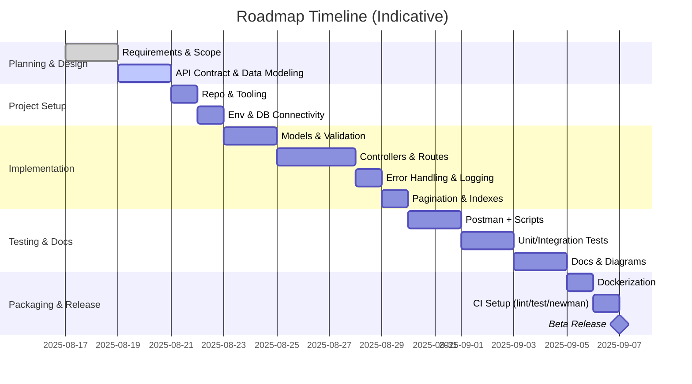
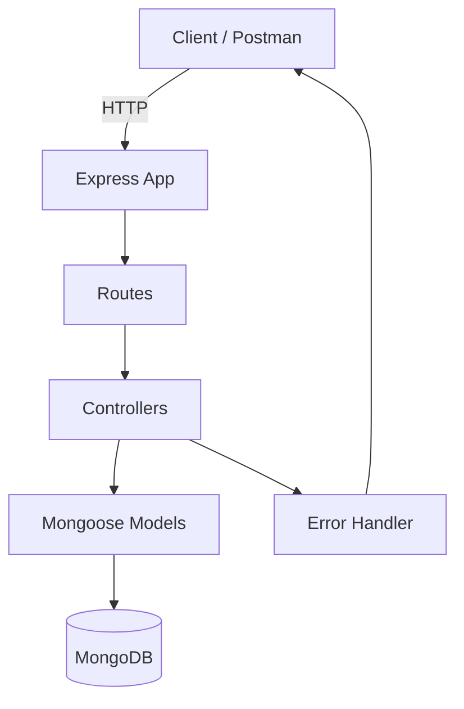

# Restaurant Food App — End‑to‑End Project Roadmap

A practical, step‑by‑step plan to design, build, test, document, and ship the backend API. Tailored to the current codebase (Node.js, Express, MongoDB, Mongoose) and the existing controllers in `controllers/food.controllers.js`.

---

## 0) Vision, Goals, and Success Criteria

- Vision: A reliable backend API to manage foods and orders for a restaurant platform.
- Primary goals (MVP)
  - CRUD for Food items
  - Filter foods by restaurant
  - Place orders and update order status
- Quality goals
  - Consistent API conventions (status codes, error shapes)
  - Proper validation and security basics
  - Clear documentation, tests, and observability
- Success criteria
  - All endpoints pass manual and automated tests
  - Stable deployment artifact (Docker)
  - Docs: user_guide, documentation, testing, diagrams complete

---

## 1) Timeline and Milestones (Gantt)

---

## 2) Architecture & High-Level Flow

Key layers:
- Routes: Versioned endpoints mapping to controllers.
- Controllers: Validation, business logic orchestration.
- Models: Mongoose schemas and data access.
- Middleware: Error handling, logging, validation, CORS.

---

## 3) Detailed Phases

### Phase 1 — Requirements and API Contract
- Define entities:
  - Food: title, description, price, imageUrl, foodTags, category, code, isAvailable, restaurant, rating
  - Order: foods[], payment, buyer, status (placed|preparing|out-for-delivery|delivered|cancelled)
- API endpoints (v1):
  - POST /foods
  - GET /foods
  - GET /foods/:id
  - GET /foods/restaurant/:id
  - PATCH /foods/:id
  - DELETE /foods/:id
  - POST /orders
  - PATCH /orders/:id/status
- Status codes and error semantics:
  - 201 for creation, 200 for success, 400 for validation, 404 for not found, 500 for server errors.
- Response shape convention:
  - { success: boolean, message?: string, data?: any, meta?: object }

### Phase 2 — Project Setup
- Initialize Node project and tooling:
  - PowerShell:
    - npm init -y
    - npm i express mongoose cors dotenv morgan
    - npm i -D nodemon
- package.json scripts:
  - "start": "node server.js"
  - "dev": "nodemon server.js"
- .gitignore, EditorConfig, Prettier/ESLint (optional but recommended).

### Phase 3 — Configuration and Environments
- Create .env (development):
  - PORT=8080
  - MONGO_URI=mongodb://localhost:27017/restaurant_food_app
- Load dotenv early in server bootstrap.
- Validate required env vars on startup; fail fast with helpful logs.

### Phase 4 — Data Modeling (Mongoose)
- Food schema:
  - Required: title, description, price, restaurant
  - Optional: imageUrl, foodTags[], category (enum), code, isAvailable (default true), rating (0..5)
  - Indexes: restaurant+title (compound), code unique per restaurant (optional)
- Order schema:
  - foods: [ObjectId] (ref "Food", min length 1)
  - payment: Number >= 0
  - buyer: ObjectId/String
  - status: enum with default "placed"
  - Index: createdAt, buyer (for querying user orders)

Migration note:
- Current code contains typos: catgeory, isAvailabe, resturnat.
- Plan to refactor models & controllers to correct names; provide migration mapping and a short deprecation window.

### Phase 5 — Routes and Controllers
- Implement routes under /api/v1, group by resource (foods, orders).
- Controllers (from current file, with improvements):
  - createFoodController: 400 on missing fields; normalize names; trim strings.
  - getAllFoodsController: 200 with array (empty allowed); support pagination (limit, page).
  - getSingleFoodController: validate ObjectId; 404 when not found.
  - getFoodByRestaurantController: ensure restaurant id validation; 200 with [] if none.
  - updateFoodController: partial updates; validate fields; return updated resource.
  - deleteFoodController: id validation; 200 on successful delete.
  - placeOrderController: verify cart ids, re-fetch foods to compute server-side totals, ignore client prices.
  - orderStatusController: validate status enum and transition rules; return updated order.
- Add centralized error middleware and not-found handler.

### Phase 6 — Validation and Security
- Validation:
  - Request schemas with Joi/Zod (body, params, query).
  - Mongoose validation for persistence guarantees.
  - ObjectId checks: mongoose.isValidObjectId
- Security hardening:
  - CORS restrictions (origins per environment).
  - Helmet (if serving public API).
  - Rate limiting (express-rate-limit) to prevent abuse.
  - Input sanitization (xss-clean or similar); reject unknown fields.
  - Do not trust client-provided totals; re-calc on server.
  - Consistent error messages; avoid leaking stack traces in production.

### Phase 7 — Observability and Logging
- HTTP logs: morgan ('dev' in dev, 'combined' in prod).
- Structured app logs: winston or pino (optional).
- Health endpoint: GET /health returns { status: "ok", uptime }.
- Correlation IDs: propagate x-correlation-id for tracing (optional).

### Phase 8 — Performance, Pagination, and Indexes
- Use .lean() for read-heavy endpoints.
- Add pagination to GET /foods:
  - Query: ?page=1&limit=20&sort=-createdAt
  - Response meta: { page, limit, total, pages }
- Index fields used by filters: restaurant, title, createdAt.

### Phase 9 — Testing Strategy
- Manual verification: Postman Collection for all endpoints.
- Scripting: Postman tests to capture IDs and assert status codes/shape.
- CLI automation: newman run in CI; HTML report export.
- Unit tests (Jest/Mocha):
  - Controllers with mocked models.
- Integration tests:
  - Spin up real MongoDB (local or test container), seed, and test data flows.
- Test data seeding scripts for quick local setup.

### Phase 10 — Documentation
- Create and maintain:
  - user_guide.md (setup + usage)
  - documentation.md (deep technical docs)
  - diagrams.md (Mermaid diagrams)
  - testing.md (Postman + newman)
- Keep docs updated with versioned changes.

### Phase 11 — Packaging and Deployment
- Dockerization:
  - Multi-stage Dockerfile (build → runtime) for Node app.
  - docker-compose.yml for API + MongoDB (local dev).
- Environment separation:
  - .env.development, .env.test, .env.production
- CI pipeline:
  - Install → Lint → Unit tests → newman → Build image → Publish artifact
- Rollout:
  - Canary or blue/green (environment-dependent).

### Phase 12 — Maintenance and Iteration
- Track technical debt:
  - Typos in schema/fields: fix ASAP, provide compatibility layer temporarily.
  - Return updated object in update endpoints.
- Versioning:
  - API v1; use semantic