# Restaurant Food App — Detailed Project Creation Roadmap

This comprehensive roadmap guides you through building a complete Restaurant Food App backend from inception to production deployment. Each phase includes detailed steps, best practices, and interactive Mermaid diagrams.

## 🎯 Project Overview

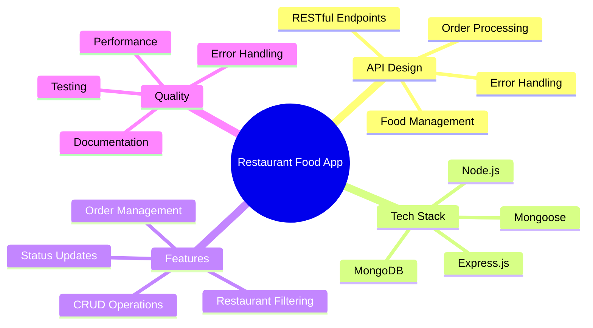

## 📋 Phase 0: Project Planning & Setup

### 0.1 Requirements Analysis

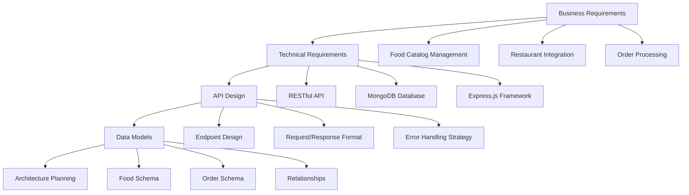

### 0.2 Technology Stack Decision

| Technology | Purpose | Rationale |
|------------|---------|-----------|
| Node.js | Runtime | JavaScript ecosystem, async I/O |
| Express.js | Web Framework | Lightweight, flexible, extensive middleware |
| MongoDB | Database | Document-based, flexible schema |
| Mongoose | ODM | Schema validation, query building |
| Postman/Newman | API Testing | Comprehensive testing capabilities |

### 0.3 Project Structure Planning

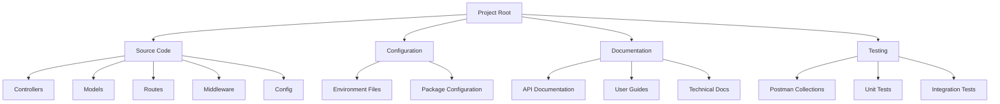

## 🛠 Phase 1: Environment Setup

### 1.1 Development Environment

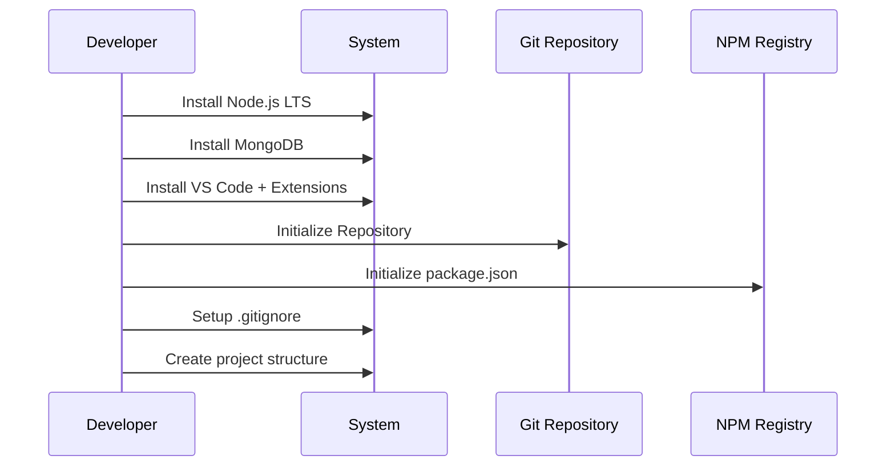

### 1.2 Initial Project Setup

**Step 1: Initialize Project**
```bash
mkdir "Restaurant Food App"
cd "Restaurant Food App"
npm init -y
git init
```

**Step 2: Install Core Dependencies**
```bash
npm install express mongoose cors dotenv morgan
npm install --save-dev nodemon
```

**Step 3: Create Directory Structure**
```
├── controllers/
├── models/
├── routes/
├── middleware/
├── config/
├── docs/
├── postman/
├── .env
├── .gitignore
├── server.js
└── package.json
```

### 1.3 Environment Configuration

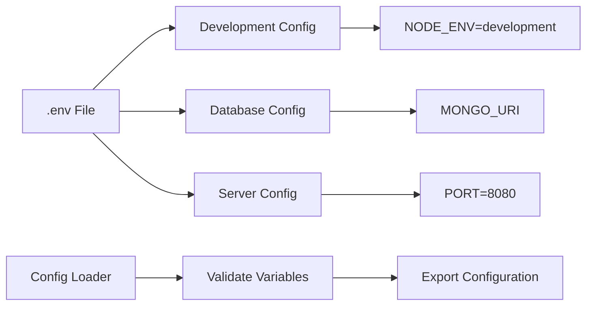

## 🗄 Phase 2: Database Design & Models

### 2.1 Entity Relationship Design

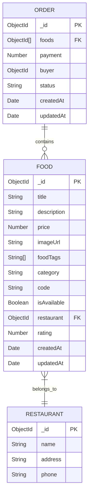

### 2.2 Model Implementation Strategy

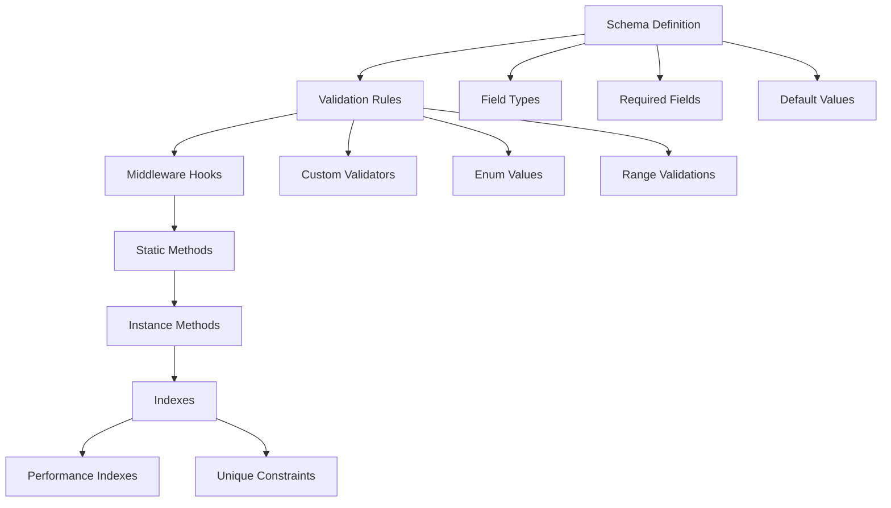

### 2.3 Food Model Implementation

**Key Features:**
- Comprehensive validation
- Proper field naming (fixing typos)
- Performance indexes
- Business logic methods

### 2.4 Order Model Implementation

**Key Features:**
- Status enum with transitions
- Payment validation
- Food reference integrity
- Audit trails

## 🎮 Phase 3: Controllers Development

### 3.1 Controller Architecture

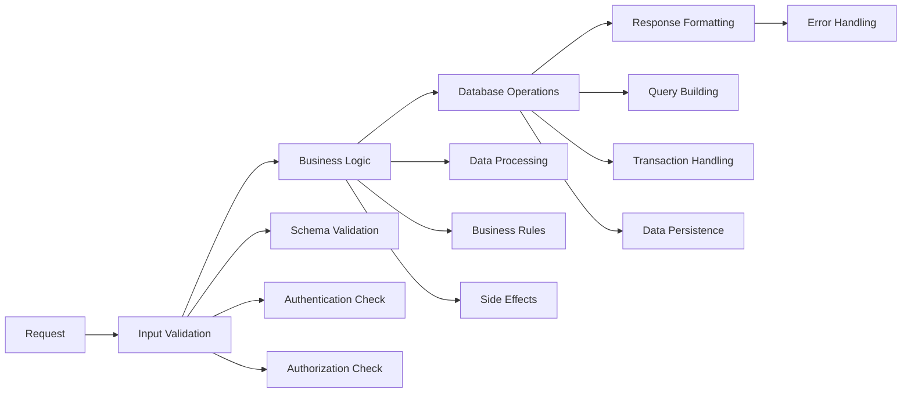

### 3.2 Food Controllers Implementation Plan

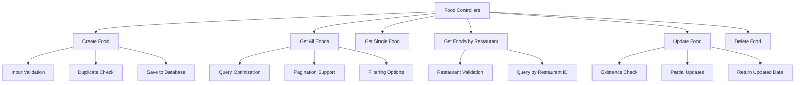

### 3.3 Order Controllers Implementation Plan

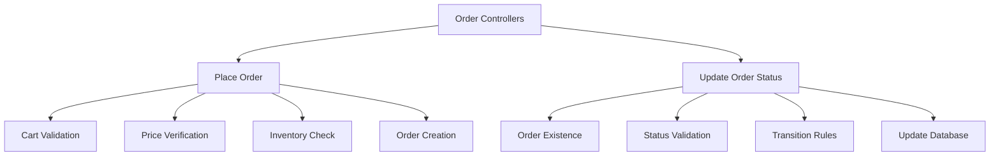

### 3.4 Error Handling Strategy

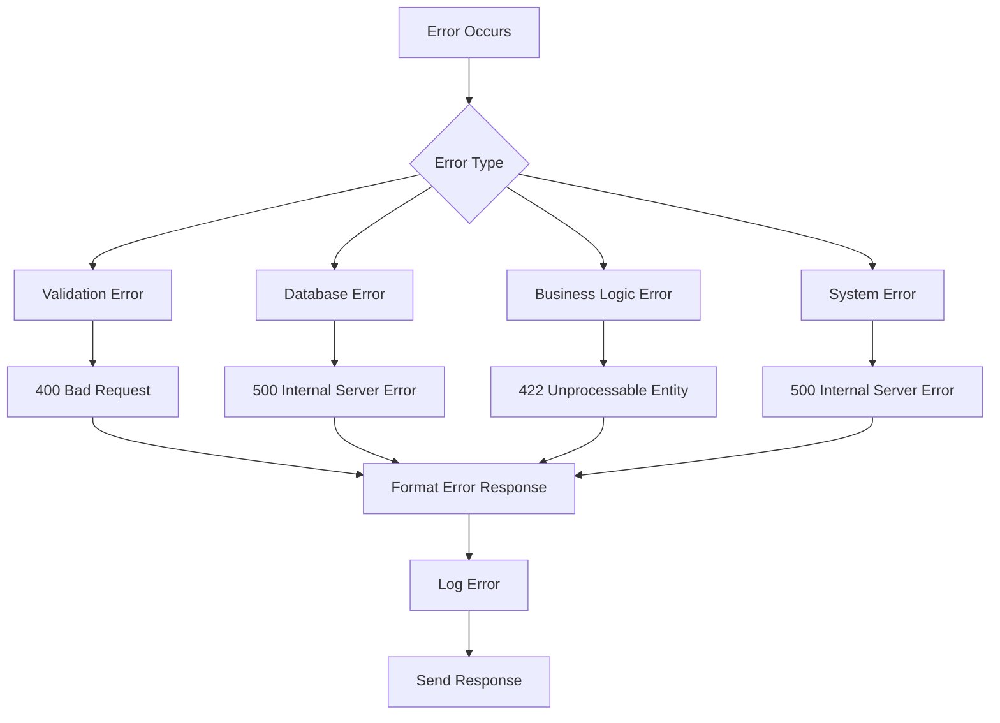

## 🛣 Phase 4: Routes & Middleware

### 4.1 Route Structure Design

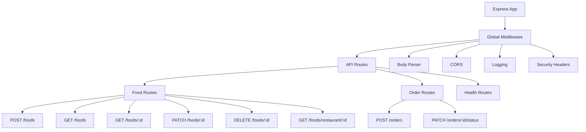

### 4.2 Middleware Implementation

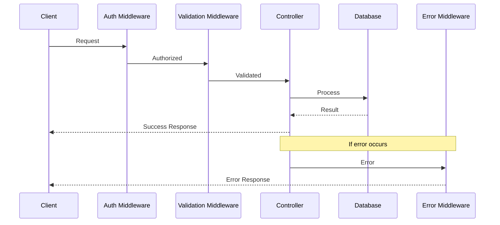

### 4.3 API Versioning Strategy

```mermaid
flowchart LR
    A[Base URL] --> B[Version Prefix]
    B --> C[Resource Routes]
    
    A --> A1[http://localhost:8080]
    B --> B1[/api/v1]
    C --> C1[/foods]
    C --> C2[/orders]
    
    D[Future Versions] --> D1[/api/v2]
    D1 --> D2[Backward Compatibility]
    D2 --> D3[Migration Strategy]
```

## 🧪 Phase 5: Testing Strategy

### 5.1 Testing Pyramid

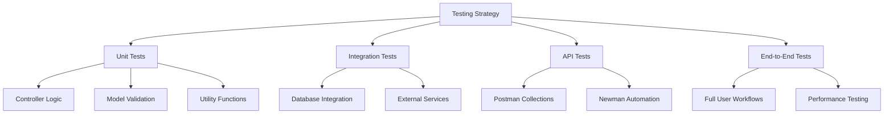

### 5.2 Postman Testing Workflow

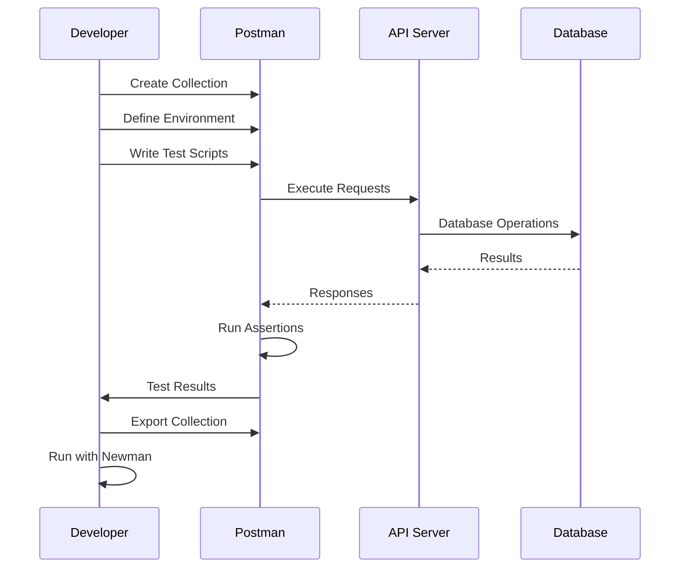

### 5.3 Test Data Management

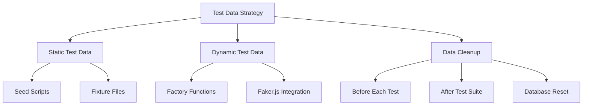

## 📚 Phase 6: Documentation

### 6.1 Documentation Structure

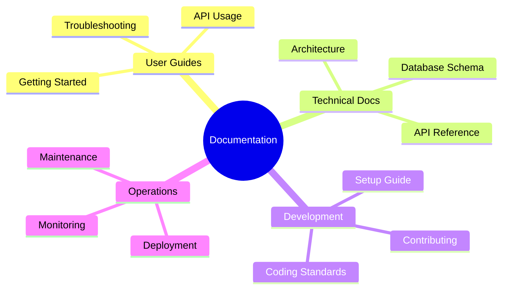

### 6.2 API Documentation Strategy

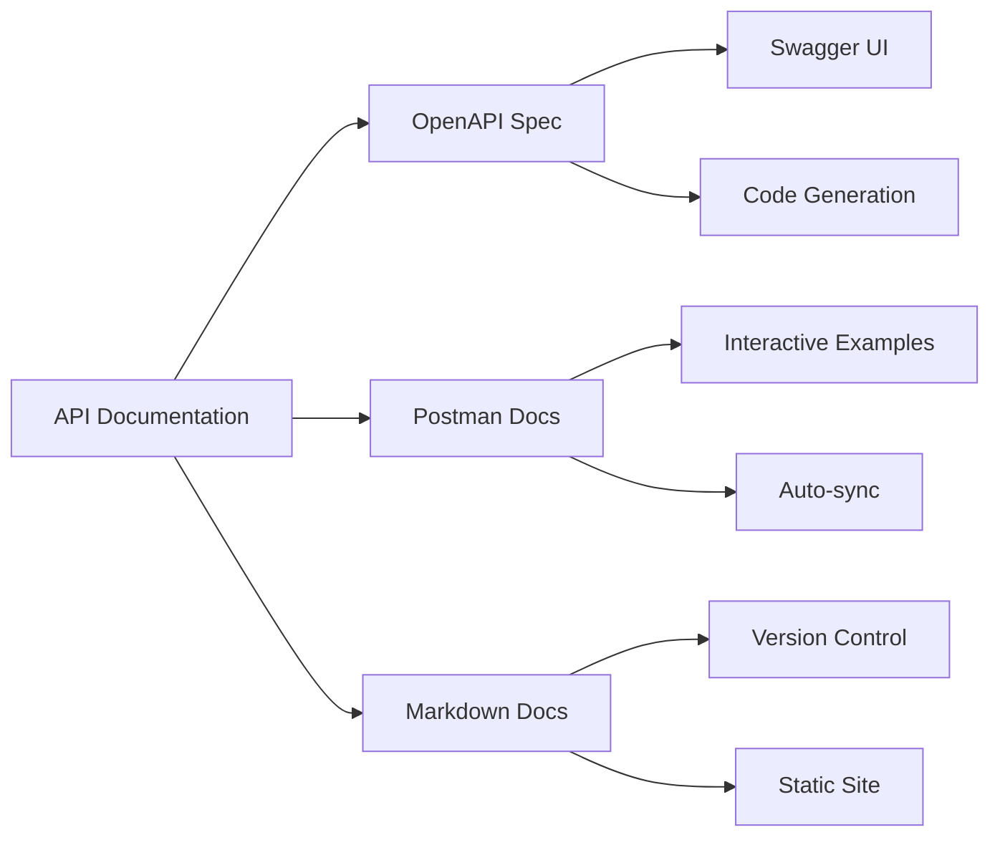

## 🚀 Phase 7: Performance & Optimization

### 7.1 Performance Optimization Strategy

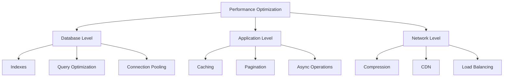

### 7.2 Database Optimization

```mermaid
flowchart TD
    A[Database Optimization] --> B[Index Strategy]
    A --> C[Query Performance]
    A --> D[Connection Management]
    
    B --> B1[Single Field Indexes]
    B --> B2[Compound Indexes]
    B --> B3[Text Search Indexes]
    
    C --> C1[Query Analysis]
    C --> C2[Aggregation Pipeline]
    C --> C3[Projection Optimization]
    
    D --> D1[Connection Pooling]
    D --> D2[Connection Limits]
    D --> D3[Timeout Configuration]
```

## 🔒 Phase 8: Security Implementation

### 8.1 Security Layers

```mermaid
graph TD
    A[Security Implementation] --> B[Input Validation]
    A --> C[Authentication]
    A --> D[Authorization]
    A --> E[Data Protection]
    
    B --> B1[Schema Validation]
    B --> B2[Sanitization]
    B --> B3[Rate Limiting]
    
    C --> C1[JWT Tokens]
    C --> C2[Session Management]
    
    D --> D1[Role-based Access]
    D --> D2[Resource-level Permissions]
    
    E --> E1[Encryption at Rest]
    E --> E2[HTTPS/TLS]
    E --> E3[Sensitive Data Masking]
```

### 8.2 Security Checklist

```mermaid
flowchart LR
    A[Security Audit] --> B[Input Validation]
    A --> C[Output Encoding]
    A --> D[Authentication]
    A --> E[Authorization]
    A --> F[Session Management]
    A --> G[Error Handling]
    A --> H[Logging & Monitoring]
    
    B --> B1[✓ Schema Validation]
    B --> B2[✓ SQL Injection Prevention]
    B --> B3[✓ XSS Prevention]
```

## 🐳 Phase 9: Containerization & Deployment

### 9.1 Docker Implementation

```mermaid
flowchart TD
    A[Containerization] --> B[Dockerfile]
    A --> C[Docker Compose]
    A --> D[Multi-stage Build]
    
    B --> B1[Base Image Selection]
    B --> B2[Dependency Installation]
    B --> B3[Application Setup]
    B --> B4[Security Hardening]
    
    C --> C1[Application Container]
    C --> C2[Database Container]
    C --> C3[Networking Configuration]
    
    D --> D1[Build Stage]
    D --> D2[Production Stage]
    D --> D3[Size Optimization]
```

### 9.2 Deployment Pipeline

```mermaid
sequenceDiagram
    participant Dev as Developer
    participant Git as Git Repository
    participant CI as CI/CD Pipeline
    participant Test as Test Environment
    participant Prod as Production
    
    Dev->>Git: Push Code
    Git->>CI: Trigger Build
    CI->>CI: Run Tests
    CI->>CI: Build Docker Image
    CI->>Test: Deploy to Staging
    CI->>CI: Run Integration Tests
    CI->>Prod: Deploy to Production
    Prod-->>CI: Deployment Status
    CI-->>Dev: Notification
```

### 9.3 Environment Configuration

```mermaid
graph TD
    A[Environment Management] --> B[Development]
    A --> C[Staging]
    A --> D[Production]
    
    B --> B1[Local Database]
    B --> B2[Debug Logging]
    B --> B3[Hot Reload]
    
    C --> C1[Shared Database]
    C --> C2[Integration Tests]
    C --> C3[Performance Testing]
    
    D --> D1[Production Database]
    D --> D2[Error Monitoring]
    D --> D3[Load Balancing]
```

## 📊 Phase 10: Monitoring & Maintenance

### 10.1 Monitoring Strategy

```mermaid
graph TD
    A[Monitoring] --> B[Application Metrics]
    A --> C[Infrastructure Metrics]
    A --> D[Business Metrics]
    
    B --> B1[Response Times]
    B --> B2[Error Rates]
    B --> B3[Throughput]
    
    C --> C1[CPU Usage]
    C --> C2[Memory Usage]
    C --> C3[Disk I/O]
    
    D --> D1[Orders Placed]
    D --> D2[Popular Foods]
    D --> D3[Restaurant Performance]
```

### 10.2 Logging Implementation

```mermaid
flowchart LR
    A[Application] --> B[Structured Logging]
    B --> C[Log Aggregation]
    C --> D[Log Analysis]
    
    B --> B1[Request Logs]
    B --> B2[Error Logs]
    B --> B3[Audit Logs]
    
    C --> C1[Centralized Storage]
    C --> C2[Log Rotation]
    
    D --> D1[Search & Filter]
    D --> D2[Alerting]
    D --> D3[Dashboards]
```

## 🔄 Phase 11: Maintenance & Updates

### 11.1 Maintenance Workflow

```mermaid
flowchart TD
    A[Maintenance Cycle] --> B[Monitoring]
    B --> C[Issue Detection]
    C --> D[Impact Assessment]
    D --> E[Fix Development]
    E --> F[Testing]
    F --> G[Deployment]
    G --> H[Verification]
    H --> B
    
    C --> C1[Performance Issues]
    C --> C2[Security Vulnerabilities]
    C --> C3[Feature Requests]
    C --> C4[Bug Reports]
```

### 11.2 Update Strategy

```mermaid
graph TD
    A[Update Management] --> B[Dependency Updates]
    A --> C[Security Patches]
    A --> D[Feature Updates]
    
    B --> B1[Regular Audits]
    B --> B2[Compatibility Testing]
    B --> B3[Gradual Rollout]
    
    C --> C1[Immediate Patches]
    C --> C2[Security Scanning]
    
    D --> D1[Version Planning]
    D --> D2[Breaking Changes]
    D --> D3[Migration Scripts]
```

## 🎯 Enhanced Project Timeline

```mermaid
gantt
    title Restaurant Food App Development Timeline
    dateFormat YYYY-MM-DD
    axisFormat %m/%d
    
    %% Planning Phase
    section 📋 Planning
    Requirements Analysis     :crit, req, 2024-01-01, 3d
    Architecture Design      :crit, arch, after req, 2d
    Technology Selection     :tech, after arch, 1d
    
    %% Setup Phase  
    section 🛠 Environment Setup
    Node.js & MongoDB Setup  :setup1, 2024-01-06, 1d
    Project Initialization   :setup2, after setup1, 1d
    Directory Structure      :setup3, after setup2, 1d
    Git Repository Setup     :setup4, after setup3, 1d
    
    %% Development Phase
    section 💻 Core Development
    Database Schema Design   :active, db1, 2024-01-10, 2d
    Food Model Implementation :db2, after db1, 2d
    Order Model Implementation :db3, after db2, 1d
    Food Controllers        :ctrl1, after db3, 3d
    Order Controllers       :ctrl2, after ctrl1, 2d
    Routes & Middleware     :routes, after ctrl2, 2d
    Error Handling         :error, after routes, 1d
    
    %% Testing Phase
    section 🧪 Testing & Validation
    Unit Tests Development  :test1, after error, 3d
    Postman Collection     :test2, after test1, 2d
    API Integration Tests  :test3, after test2, 2d
    Newman Automation     :test4, after test3, 1d
    Load Testing         :test5, after test4, 1d
    
    %% Documentation Phase
    section 📚 Documentation
    API Documentation     :docs1, after test5, 2d
    User Guide Creation   :docs2, after docs1, 2d
    Technical Documentation :docs3, after docs2, 2d
    Diagram Creation     :docs4, after docs3, 1d
    
    %% Security & Performance
    section 🔒 Security & Performance
    Security Implementation :sec1, after docs4, 2d
    Performance Optimization :perf1, after sec1, 2d
    Code Review & Refactoring :review, after perf1, 2d
    
    %% Deployment Phase
    section 🚀 Deployment
    Docker Configuration   :docker1, after review, 2d
    Docker Compose Setup  :docker2, after docker1, 1d
    CI/CD Pipeline Setup  :cicd1, after docker2, 3d
    Staging Deployment   :deploy1, after cicd1, 1d
    Production Deployment :crit, deploy2, after deploy1, 1d
    
    %% Operations Phase
    section 📊 Operations
    Monitoring Setup     :ops1, after deploy2, 2d
    Logging Configuration :ops2, after ops1, 1d
    Performance Tuning   :ops3, after ops2, 2d
    Documentation Finalization :ops4, after ops3, 1d
    
    %% Maintenance Phase
    section 🔄 Maintenance
    Health Checks Setup  :maint1, after ops4, 1d
    Backup Strategy     :maint2, after maint1, 1d
    Update Procedures   :maint3, after maint2, 1d
    Team Handover      :maint4, after maint3, 1d
```

## 📋 Enhanced Implementation Checklist

### Phase 1: Foundation ✅
- [ ] **Environment Setup**
  - [ ] Node.js v18+ installed and verified
  - [ ] MongoDB Community Edition installed
  - [ ] VS Code with extensions (Thunder Client, MongoDB, GitLens)
  - [ ] Git configured with user credentials
- [ ] **Project Initialization**
  - [ ] npm project initialized with proper metadata
  - [ ] Git repository with initial commit
  - [ ] .gitignore configured for Node.js
  - [ ] Directory structure created and documented
- [ ] **Configuration**
  - [ ] Environment variables defined (.env)
  - [ ] Config module for environment management
  - [ ] Package.json scripts (start, dev, test)

### Phase 2: Core Development 🔧
- [ ] **Database Layer**
  - [ ] MongoDB connection established and tested
  - [ ] Food model with comprehensive validation
  - [ ] Order model with status enum
  - [ ] Database indexes for performance
  - [ ] Mongoose middleware hooks
- [ ] **Business Logic**
  - [ ] Food CRUD operations (Create, Read, Update, Delete)
  - [ ] Restaurant-based food filtering
  - [ ] Order placement with cart validation
  - [ ] Order status management
  - [ ] Server-side price calculation
- [ ] **API Layer**
  - [ ] Express server configuration
  - [ ] RESTful route definitions
  - [ ] Middleware stack (CORS, body parser, logging)
  - [ ] Error handling middleware
  - [ ] Request validation

### Phase 3: Testing & Quality 🧪
- [ ] **API Testing**
  - [ ] Postman collection with all endpoints
  - [ ] Environment variables setup
  - [ ] Test scripts for assertions
  - [ ] Newman automation configured
  - [ ] Integration test scenarios
- [ ] **Code Quality**
  - [ ] Input validation for all endpoints
  - [ ] Error responses standardized
  - [ ] Logging implemented (request/error logs)
  - [ ] Code linting and formatting
  - [ ] Security best practices applied

### Phase 4: Documentation & Deployment 📚
- [ ] **Documentation**
  - [ ] API documentation with examples
  - [ ] User guide for setup and usage
  - [ ] Technical architecture documentation
  - [ ] Troubleshooting guides
  - [ ] Code comments and inline documentation
- [ ] **Deployment Readiness**
  - [ ] Docker containerization
  - [ ] Environment-specific configurations
  - [ ] Production-ready logging
  - [ ] Health check endpoints
  - [ ] Performance monitoring setup

### Phase 5: Production & Maintenance 🚀
- [ ] **Production Deployment**
  - [ ] CI/CD pipeline functional
  - [ ] Database migration scripts
  - [ ] SSL/TLS configuration
  - [ ] Load balancing setup (if applicable)
  - [ ] Backup and recovery procedures
- [ ] **Monitoring & Maintenance**
  - [ ] Application metrics tracking
  - [ ] Error alerting configured
  - [ ] Regular security updates
  - [ ] Performance optimization
  - [ ] Documentation updates

## 🚀 Success Metrics Dashboard

```mermaid
pie title Project Success Metrics
    "Core Functionality" : 25
    "API Performance" : 20
    "Code Quality" : 15
    "Documentation" : 15
    "Testing Coverage" : 15
    "Security" : 10
```

### Key Performance Indicators (KPIs):

**Technical Excellence:**
- ⚡ API response time < 200ms (95th percentile)
- 🔒 Zero critical security vulnerabilities
- 📊 90%+ test coverage on core functionality
- 🚀 99.9% uptime in production environment

**Development Quality:**
- 📝 100% API endpoints documented
- ✅ All CRUD operations functional
- 🧪 Automated testing pipeline
- 🔄 CI/CD pipeline operational

**Operational Readiness:**
- 📈 Monitoring and alerting active
- 💾 Backup and recovery tested
- 🛡️ Security measures implemented
- 📚 Comprehensive user documentation

## 🎉 Project Completion Deliverables

Upon successful completion of all phases, you will have delivered:

### 🎯 **Functional Deliverables**
- ✅ Fully functional Restaurant Food App API
- ✅ Complete food catalog management system
- ✅ Order processing and status tracking
- ✅ Restaurant-based food filtering
- ✅ Robust error handling and validation

### 📋 **Technical Deliverables**
- ✅ Production-ready codebase
- ✅ Comprehensive test suite (Postman + Newman)
- ✅ Docker containerization
- ✅ CI/CD pipeline
- ✅ Monitoring and logging infrastructure

### 📚 **Documentation Deliverables**
- ✅ Complete API documentation
- ✅ User setup and usage guides
- ✅ Technical architecture documentation
- ✅ Deployment and maintenance procedures
- ✅ Interactive diagrams and flowcharts

### 🔧 **Operational Deliverables**
- ✅ Environment configuration templates
- ✅ Database backup and recovery procedures
- ✅ Security hardening guidelines
- ✅ Performance optimization recommendations
- ✅ Maintenance and update procedures

---

## 🏁 **Final Notes**

This roadmap provides a systematic, phase-by-phase approach to building a production-ready Restaurant Food App backend. Each phase builds upon the previous one, ensuring solid foundations and incremental progress toward a robust, scalable, and maintainable application.

**Remember:** Quality over speed - take time to properly implement each phase before moving to the next. This approach will save significant time and effort in debugging and maintenance later.

**Success Formula:** Planning + Implementation + Testing + Documentation =