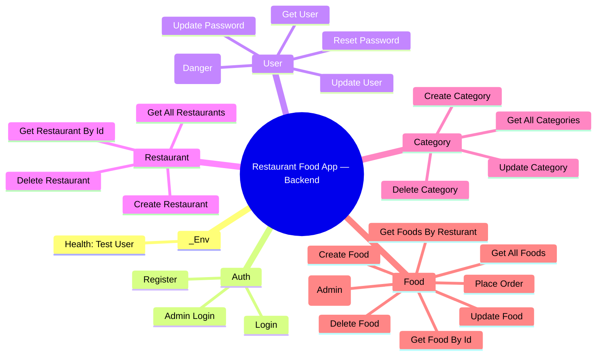

# Testing — Interactive Postman Guide

This guide is an interactive, step‑by‑step playbook to test the Restaurant Food App backend with Postman and Newman. It includes a curated collection structure, endpoint matrix, scripts you can reuse, flows, negative tests, data‑driven runs, and CI examples.

- App base URL: http://localhost:8080
- API base path: /api/v1
- Collection style: foldered by domain, with chained variables and reusable scripts

---

## Table of Contents

- Quick Start (checkboxes)
- Visual Testing Workflow
- Collection Structure (mindmap)
- Environment Setup (UI + JSON template)
- Authorization and Variable Chaining
- Endpoint Matrix (what to call and why)
- Folder-by-Folder Deep Tests
- Negative Tests (robustness)
- Data-Driven Runner (CSV)
- Newman CLI (Windows examples)
- CI Integration (GitHub Actions)
- Troubleshooting

---

## Quick Start

- [ ] Start API server: ensure PORT and MONGO_URL are set and node server.js is running
- [ ] Install Postman (or use Postman Desktop Agent)
- [ ] Import Environment JSON (below) and set it active
- [ ] Import the Collection JSON (below)
- [ ] Run Auth/Login to capture jwt
- [ ] Run Restaurant/Category/Food flows
- [ ] Place an order and then update status (admin)
- [ ] Export run results or run via Newman

Tip (VS Code on Windows): Ctrl+` opens the integrated terminal.

---

## Visual Testing Workflow

```mermaid
flowchart LR
  A[Set Environment] --> B[Auth/Register (optional)]
  B --> C[Auth/Login]
  C -->|save jwt| D[User Tests]
  D --> E[Restaurant Tests]
  E --> F[Category Tests]
  F --> G[Food Tests]
  G --> H[Place Order]
  H --> I{Admin Login?}
  I -- yes --> J[Order Status Update]
  I -- no --> K[Stop]
  J --> L[Reports (Newman/Runner)]
```

---

## Collection Structure (at a glance)



---

## Environment Setup

Use a dedicated environment and keep secrets out of the collection.

- Postman UI:
  - Create Environment → add variables: baseUrl, email, password, adminEmail, adminPassword, jwt, adminJwt, userId, restaurantId, categoryId, foodId, orderId.
  - Set baseUrl to http://localhost:8080/api/v1
  - Save and set active (top-right environment selector).

- Importable Environment JSON:
```json
{
  "id": "0f000000-0000-4000-8000-000000000001",
  "name": "Restaurant Food App — Local",
  "values": [
    { "key": "baseUrl", "value": "http://localhost:8080/api/v1", "type": "text" },
    { "key": "email", "value": "tester@example.com", "type": "text" },
    { "key": "password", "value": "Str0ngP@ssw0rd!", "type": "text" },
    { "key": "adminEmail", "value": "admin@example.com", "type": "text" },
    { "key": "adminPassword", "value": "AdminStr0ngP@ss!", "type": "text" },
    { "key": "jwt", "value": "", "type": "text" },
    { "key": "adminJwt", "value": "", "type": "text" },
    { "key": "userId", "value": "", "type": "text" },
    { "key": "restaurantId", "value": "", "type": "text" },
    { "key": "categoryId", "value": "", "type": "text" },
    { "key": "foodId", "value": "", "type": "text" },
    { "key": "orderId", "value": "", "type": "text" }
  ],
  "_postman_variable_scope": "environment",
  "_postman_exported_using": "Postman/10.x",
  "_postman_exported_at": "2025-08-17T00:00:00.000Z"
}
```

---

## Authorization and Variable Chaining

- Auth is via JWT: send Authorization: Bearer {{jwt}} on protected routes.
- Best practice: add a collection-level Pre-request Script to auto-attach Authorization if not set.

Pre-request Script (collection-level):
```js
const jwt = pm.environment.get("jwt");
if (jwt && !pm.request.headers.has("Authorization")) {
  pm.request.headers.add({ key: "Authorization", value: `Bearer ${jwt}` });
}
```

Reusable login test (saves jwt and userId):
```js
pm.test("2xx",()=>pm.expect(pm.response.code).to.be.within(200,299));
const json = pm.response.json();
pm.environment.set("jwt", json.token || json.data?.token);
pm.environment.set("userId", json.user?._id || json.data?.user?._id);
pm.expect(pm.environment.get("jwt")).to.be.a("string");
```

---

## Endpoint Matrix (overview)

- Auth
  - POST {{baseUrl}}/auth/register — public — body: userName, email, password, phone, address[], answer
  - POST {{baseUrl}}/auth/login — public — body: email, password — returns token

- User (protected)
  - GET {{baseUrl}}/user/getUser — returns current user (sans password)
  - PUT {{baseUrl}}/user/updateUser — body: userName?, phone?, address?
  - POST {{baseUrl}}/user/updatePassword — body: currentPassword, newPassword
  - POST {{baseUrl}}/user/resetPassword — body: email, answer, newPassword
  - DELETE {{baseUrl}}/user/deleteUser

- Restaurant
  - POST {{baseUrl}}/resturant/create — protected
  - GET {{baseUrl}}/resturant/getAll — public
  - GET {{baseUrl}}/resturant/get/:id — public
  - DELETE {{baseUrl}}/resturant/delete/:id — protected

- Category
  - POST {{baseUrl}}/category/create — protected
  - GET {{baseUrl}}/category/getAll — public
  - PUT {{baseUrl}}/category/update/:id — protected
  - DELETE {{baseUrl}}/category/delete/:id — protected

- Food
  - POST {{baseUrl}}/food/create — protected
  - GET {{baseUrl}}/food/getAll — public
  - GET {{baseUrl}}/food/get/:id — public
  - GET {{baseUrl}}/food/getByResturant/:id — public
  - PUT {{baseUrl}}/food/update/:id — protected
  - DELETE {{baseUrl}}/food/delete/:id — protected
  - POST {{baseUrl}}/food/placeorder — protected — body: cart[], id (buyer)
  - POST {{baseUrl}}/food/orderStatus/:id — protected + admin

---

## Folder-by-Folder Deep Tests

Use these as guided tasks. Expand each section to see example requests, bodies, and tests.

<details>
<summary><strong>_Env / Health</strong></summary>

- GET {{baseUrl}}/test/test-user
Tests:
```js
pm.test("200 OK", () => pm.response.to.have.status(200));
```
</details>

<details>
<summary><strong>Auth</strong></summary>

Register:
```http
POST {{baseUrl}}/auth/register
Content-Type: application/json
{
  "userName": "Test User",
  "email": "{{email}}",
  "password": "{{password}}",
  "phone": "1234567890",
  "address": ["123 Main St"],
  "answer": "pet"
}
```
Tests:
```js
pm.test("Registered (2xx)",()=>pm.expect(pm.response.code).to.be.within(200,299));
pm.test("No plain password in response", ()=> pm.expect(pm.response.text()).to.not.include('"password":"'));
```

Login (saves jwt):
```http
POST {{baseUrl}}/auth/login
Content-Type: application/json
{ "email": "{{email}}", "password": "{{password}}" }
```
Tests: use the reusable login test above.

Admin Login (saves adminJwt):
```js
const json = pm.response.json();
pm.environment.set("adminJwt", json.token || json.data?.token);
```
</details>

<details>
<summary><strong>User</strong></summary>

Get User:
```http
GET {{baseUrl}}/user/getUser
Authorization: Bearer {{jwt}}
```

Update User:
```http
PUT {{baseUrl}}/user/updateUser
Authorization: Bearer {{jwt}}
Content-Type: application/json
{ "userName": "Updated", "phone": "9876543210", "address": ["456 Second St"] }
```

Update Password:
```http
POST {{baseUrl}}/user/updatePassword
Authorization: Bearer {{jwt}}
Content-Type: application/json
{ "currentPassword": "{{password}}", "newPassword": "{{password}}1!" }
```

Reset Password:
```http
POST {{baseUrl}}/user/resetPassword
Authorization: Bearer {{jwt}}
Content-Type: application/json
{ "email": "{{email}}", "answer": "pet", "newPassword": "{{password}}2!" }
```

Delete User:
```http
DELETE {{baseUrl}}/user/deleteUser
Authorization: Bearer {{jwt}}
```
</details>

<details>
<summary><strong>Restaurant</strong></summary>

Create:
```http
POST {{baseUrl}}/resturant/create
Authorization: Bearer {{jwt}}
Content-Type: application/json
{
  "title": "Pizza Hut",
  "imageUrl": "https://example.com/pizza.jpg",
  "time": "9am-9pm",
  "pickup": true, "delivery": true, "isOpen": true,
  "logoUrl": "https://example.com/logo.png",
  "rating": 4.5, "ratingCount": "100",
  "code": "PIZZAHUT001",
  "coords": {
    "id": "ph-1","latitude": 12.34,"latitudeDelta": 0.01,
    "longitude": 56.78,"longitudeDelta": 0.01,
    "address": "Mumbai, India","title": "Pizza Hut Mumbai"
  }
}
```
Tests:
```js
const json = pm.response.json();
pm.environment.set("restaurantId", json.data?._id || json._id);
pm.test("Created",()=>pm.expect(pm.response.code).to.be.within(200,299));
```

List:
```http
GET {{baseUrl}}/resturant/getAll
```

Get By Id:
```http
GET {{baseUrl}}/resturant/get/{{restaurantId}}
```

Delete:
```http
DELETE {{baseUrl}}/resturant/delete/{{restaurantId}}
Authorization: Bearer {{jwt}}
```
</details>

<details>
<summary><strong>Category</strong></summary>

Create:
```http
POST {{baseUrl}}/category/create
Authorization: Bearer {{jwt}}
Content-Type: application/json
{ "title": "Pizza", "imageUrl": "https://example.com/pizza-cat.png" }
```
Tests:
```js
const json = pm.response.json();
pm.environment.set("categoryId", json.data?._id || json._id);
pm.test("2xx",()=>pm.expect(pm.response.code).to.be.within(200,299));
```

List:
```http
GET {{baseUrl}}/category/getAll
```

Update:
```http
PUT {{baseUrl}}/category/update/{{categoryId}}
Authorization: Bearer {{jwt}}
Content-Type: application/json
{ "title": "Updated Pizza", "imageUrl": "https://example.com/pizza-updated.png" }
```

Delete:
```http
DELETE {{baseUrl}}/category/delete/{{categoryId}}
Authorization: Bearer {{jwt}}
```
</details>

<details>
<summary><strong>Food</strong></summary>

Create:
```http
POST {{baseUrl}}/food/create
Authorization: Bearer {{jwt}}
Content-Type: application/json
{
  "title": "Margherita",
  "description": "Classic pizza",
  "price": 9.99,
  "imageUrl": "https://example.com/margherita.jpg",
  "foodTags": "vegetarian",
  "catgeory": "Pizza",
  "code": "FOOD-001",
  "isAvailabe": true,
  "resturnat": "{{restaurantId}}",
  "rating": 5
}
```
Tests:
```js
const json = pm.response.json();
pm.environment.set("foodId", json.data?._id || json._id);
pm.test("2xx",()=>pm.expect(pm.response.code).to.be.within(200,299));
```

List:
```http
GET {{baseUrl}}/food/getAll
```

Get By Id:
```http
GET {{baseUrl}}/food/get/{{foodId}}
```

Get By Resturant:
```http
GET {{baseUrl}}/food/getByResturant/{{restaurantId}}
```

Update:
```http
PUT {{baseUrl}}/food/update/{{foodId}}
Authorization: Bearer {{jwt}}
Content-Type: application/json
{ "price": 10.49, "description": "Updated desc" }
```

Delete:
```http
DELETE {{baseUrl}}/food/delete/{{foodId}}
Authorization: Bearer {{jwt}}
```

Place Order:
```http
POST {{baseUrl}}/food/placeorder
Authorization: Bearer {{jwt}}
Content-Type: application/json
{
  "cart": [{ "id": "{{foodId}}", "price": 9.99 }],
  "id": "{{userId}}"
}
```
Tests:
```js
const json = pm.response.json();
pm.environment.set("orderId", json.data?._id || json._id);
pm.test("Order placed",()=>pm.expect(pm.response.code).to.be.within(200,299));
```

Update Order Status (Admin):
```http
POST {{baseUrl}}/food/orderStatus/{{orderId}}
Authorization: Bearer {{adminJwt}}
Content-Type: application/json
{ "status": "on the way" }
```
</details>

---

## Negative Tests (robustness)

Common scenarios:
- Unauthorized: omit Authorization on protected route → expect 401/403
- Validation: missing required fields → expect 400/422
- Not Found: invalid ObjectId or non-existing → expect 400/404
- Forbidden: user token on admin route → expect 401/403

Importable minimal negative collection:
```json
{
  "info": { "name": "Restaurant Food App — Negative Tests", "schema": "https://schema.getpostman.com/json/collection/v2.1.0/collection.json" },
  "item": [
    { "name": "Unauthorized — Get User",
      "request": { "method": "GET", "url": { "raw": "{{baseUrl}}/user/getUser", "host":["{{baseUrl}}"], "path":["user","getUser"] } },
      "event": [{ "listen": "test", "script": { "type": "text/javascript", "exec": ["pm.test(\"401/403\",()=>pm.expect([401,403]).to.include(pm.response.code));"] } }]
    },
    { "name": "Validation — Create Category without title",
      "request": { "method":"POST", "header":[{ "key":"Authorization", "value":"Bearer {{jwt}}" }, { "key":"Content-Type","value":"application/json"}],
        "body": { "mode":"raw", "raw":"{}" }, "url": { "raw":"{{baseUrl}}/category/create", "host":["{{baseUrl}}"], "path":["category","create"] } },
      "event": [{ "listen": "test", "script": { "type":"text/javascript", "exec":["pm.test(\"400/422\",()=>pm.expect([400,422]).to.include(pm.response.code));"] } }]
    },
    { "name": "Not Found — Restaurant invalid id",
      "request": { "method":"GET", "url": { "raw":"{{baseUrl}}/resturant/get/64b000000000000000000000", "host":["{{baseUrl}}"], "path":["resturant","get","64b000000000000000000000"] } },
      "event": [{ "listen":"test", "script": { "type":"text/javascript", "exec":["pm.test(\"404/400\",()=>pm.expect([404,400]).to.include(pm.response.code));"] } }]
    },
    { "name": "Forbidden — Update Order Status with user JWT",
      "request": { "method":"POST", "header":[{ "key":"Authorization","value":"Bearer {{jwt}}" },{ "key":"Content-Type","value":"application/json"}],
        "body": { "mode":"raw", "raw":"{ \"status\": \"deliverd\" }" },
        "url": { "raw":"{{baseUrl}}/food/orderStatus/{{orderId}}", "host":["{{baseUrl}}"], "path":["food","orderStatus","{{orderId}}"] } },
      "event": [{ "listen":"test", "script": { "type":"text/javascript", "exec":["pm.test(\"401/403\",()=>pm.expect([401,403]).to.include(pm.response.code));"] } }]
    }
  ]
}
```

---

## Data-Driven Runner

- Create data.csv:
```csv
email,password
load1@example.com,Str0ngP@ss1
load2@example.com,Str0ngP@ss2
```
- In Postman Runner: choose Auth/Register → Data: data.csv → set iterations → Run.

Tips:
- Use delays between requests for polite load tests.
- Combine with “Keep variable values” to re-use created users.

---

## Newman CLI (Windows)

- Install:
```powershell
npm i -g newman newman-reporter-htmlextra
```

- Run with environment and HTML report:
```powershell
newman run ".\docs\Restaurant Food App — Backend.postman_collection.json" `
  -e ".\docs\local.env.json" `
  -r cli,htmlextra `
  --reporter-htmlextra-export .\reports\newman.html
```

- JUnit report for CI:
```powershell
newman run ".\docs\Restaurant Food App — Backend.postman_collection.json" `
  -e ".\docs\local.env.json" `
  -r junit --reporter-junit-export .\reports\newman.xml
```

---

## CI Integration (GitHub Actions)

```yaml
name: API Tests
on: [push, pull_request]
jobs:
  newman:
    runs-on: windows-latest
    steps:
      - uses: actions/checkout@v4
      - uses: actions/setup-node@v4
        with: { node-version: "20" }
      - run: npm i -g newman newman-reporter-htmlextra
      - name: Run Newman
        run: |
          newman run "docs/Restaurant Food App — Backend.postman_collection.json" `
            -e "docs/local.env.json" `
            -r cli,htmlextra `
            --reporter-htmlextra-export reports\newman.html
      - uses: actions/upload-artifact@v4
        with:
          name: newman-report
          path: reports/
```

---

## Troubleshooting

- 401 on protected routes: ensure jwt is set; re-run Auth/Login; check JWT_SECRET matches server
- 403 on admin route: ensure adminJwt is used; user must have userType=admin
- 404/400 on :id routes: ensure valid ObjectId and resource exists
- Place Order buyer id: current controller expects body.id; tests set "id": "{{userId}}". If API is updated to use req.user.id, remove id from body.

---

## Importable Collection (full)

Paste into Postman → Import → Raw Text.

```json
{
  "info": {
    "name": "Restaurant Food App — Backend",
    "_postman_id": "c1f6c6e8-0000-4b00-9000-abcdefabcdef",
    "description": "End-to-end tests for the Restaurant Food App backend with variable chaining and role-based flows.",
    "schema": "https://schema.getpostman.com/json/collection/v2.1.0/collection.json"
  },
  "item": [
    {
      "name": "_Env",
      "item": [
        {
          "name": "Health: Test User",
          "request": {
            "method": "GET",
            "header": [],
            "url": { "raw": "{{baseUrl}}/test/test-user", "host": ["{{baseUrl}}"], "path": ["test","test-user"] }
          },
          "event": [{ "listen": "test", "script": { "exec": ["pm.test(\"status 200\",()=>pm.response.to.have.status(200));"], "type": "text/javascript" } }]
        }
      ]
    },
    {
      "name": "Auth",
      "item": [
        {
          "name": "Register",
          "request": {
            "method": "POST",
            "header": [{ "key": "Content-Type", "value": "application/json" }],
            "body": {
              "mode": "raw",
              "raw": "{\n  \"userName\": \"Test User\",\n  \"email\": \"{{email}}\",\n  \"password\": \"{{password}}\",\n  \"phone\": \"1234567890\",\n  \"address\": [\"123 Main St\"],\n  \"answer\": \"pet\"\n}"
            },
            "url": { "raw": "{{baseUrl}}/auth/register", "host": ["{{baseUrl}}"], "path": ["auth","register"] }
          },
          "event": [{
            "listen": "test",
            "script": {
              "type": "text/javascript",
              "exec": [
                "pm.test(\"2xx\",()=>pm.expect(pm.response.code).to.be.within(200,299));",
                "pm.test(\"no plain password\", ()=> pm.expect(pm.response.text()).to.not.include(\"\\\"password\\\":\\\"\"));"
              ]
            }
          }]
        },
        {
          "name": "Login",
          "request": {
            "method": "POST",
            "header": [{ "key": "Content-Type", "value": "application/json" }],
            "body": { "mode": "raw", "raw": "{\n  \"email\": \"{{email}}\",\n  \"password\": \"{{password}}\"\n}" },
            "url": { "raw": "{{baseUrl}}/auth/login", "host": ["{{baseUrl}}"], "path": ["auth","login"] }
          },
          "event": [{
            "listen": "test",
            "script": {
              "type": "text/javascript",
              "exec": [
                "pm.test(\"2xx\",()=>pm.expect(pm.response.code).to.be.within(200,299));",
                "const json = pm.response.json();",
                "pm.environment.set(\"jwt\", json.token || json.data?.token);",
                "pm.environment.set(\"userId\", json.user?._id || json.data?.user?._id);",
                "pm.test(\"jwt saved\", ()=> pm.expect(pm.environment.get(\"jwt\")).to.be.a(\"string\"));"
              ]
            }
          }]
        },
        {
          "name": "Admin Login",
          "request": {
            "method": "POST",
            "header": [{ "key": "Content-Type", "value": "application/json" }],
            "body": { "mode": "raw", "raw": "{\n  \"email\": \"{{adminEmail}}\",\n  \"password\": \"{{adminPassword}}\"\n}" },
            "url": { "raw": "{{baseUrl}}/auth/login", "host": ["{{baseUrl}}"], "path": ["auth","login"] }
          },
          "event": [{
            "listen": "test",
            "script": {
              "type": "text/javascript",
              "exec": [
                "const json = pm.response.json();",
                "pm.environment.set(\"adminJwt\", json.token || json.data?.token);",
                "pm.test(\"admin jwt saved\", ()=> pm.expect(pm.environment.get(\"adminJwt\")).to.be.a(\"string\"));"
              ]
            }
          }]
        }
      ]
    },
    {
      "name": "User",
      "item": [
        {
          "name": "Get User",
          "request": {
            "method": "GET",
            "header": [{ "key": "Authorization", "value": "Bearer {{jwt}}" }],
            "url": { "raw": "{{baseUrl}}/user/getUser", "host": ["{{baseUrl}}"], "path": ["user","getUser"] }
          },
          "event": [{ "listen": "test", "script": { "type": "text/javascript", "exec": ["pm.test(\"2xx\",()=>pm.expect(pm.response.code).to.be.within(200,299));","const json = pm.response.json();","pm.test(\"has email\",()=>pm.expect(json.email || json.data?.email).to.exist);"] } }]
        },
        {
          "name": "Update User",
          "request": {
            "method": "PUT",
            "header": [
              { "key": "Authorization", "value": "Bearer {{jwt}}" },
              { "key": "Content-Type", "value": "application/json" }
            ],
            "body": { "mode": "raw", "raw": "{\n  \"userName\": \"Test User Updated\",\n  \"phone\": \"9876543210\",\n  \"address\": [\"456 Second St\"]\n}" },
            "url": { "raw": "{{baseUrl}}/user/updateUser", "host": ["{{baseUrl}}"], "path": ["user","updateUser"] }
          },
          "event": [{ "listen": "test", "script": { "type": "text/javascript", "exec": ["pm.test(\"2xx\",()=>pm.expect(pm.response.code).to.be.within(200,299));"] } }]
        },
        {
          "name": "Update Password",
          "request": {
            "method": "POST",
            "header": [
              { "key": "Authorization", "value": "Bearer {{jwt}}" },
              { "key": "Content-Type", "value": "application/json" }
            ],
            "body": { "mode": "raw", "raw": "{\n  \"currentPassword\": \"{{password}}\",\n  \"newPassword\": \"{{password}}1!\"\n}" },
            "url": { "raw": "{{baseUrl}}/user/updatePassword", "host": ["{{baseUrl}}"], "path": ["user","updatePassword"] }
          },
          "event": [{ "listen": "test", "script": { "type": "text/javascript", "exec": ["pm.test(\"2xx\",()=>pm.expect(pm.response.code).to.be.within(200,299));"] } }]
        },
        {
          "name": "Reset Password",
          "request": {
            "method": "POST",
            "header": [
              { "key": "Authorization", "value": "Bearer {{jwt}}" },
              { "key": "Content-Type", "value": "application/json" }
            ],
            "body": { "mode": "raw", "raw": "{\n  \"email\": \"{{email}}\",\n  \"answer\": \"pet\",\n  \"newPassword\": \"{{password}}2!\"\n}" },
            "url": { "raw": "{{baseUrl}}/user/resetPassword", "host": ["{{baseUrl}}"], "path": ["user","resetPassword"] }
          },
          "event": [{ "listen": "test", "script": { "type": "text/javascript", "exec": ["pm.test(\"2xx\",()=>pm.expect(pm.response.code).to.be.within(200,299));"] } }]
        },
        {
          "name": "Delete User (Danger)",
          "request": {
            "method": "DELETE",
            "header": [{ "key": "Authorization", "value": "Bearer {{jwt}}" }],
            "url": { "raw": "{{baseUrl}}/user/deleteUser", "host": ["{{baseUrl}}"], "path": ["user","deleteUser"] }
          },
          "event": [{ "listen": "test", "script": { "type": "text/javascript", "exec": ["pm.test(\"2xx\",()=>pm.expect(pm.response.code).to.be.within(200,299));"] } }]
        }
      ]
    },
    {
      "name": "Restaurant",
      "item": [
        {
          "name": "Create Restaurant",
          "request": {
            "method": "POST",
            "header": [
              { "key": "Authorization", "value": "Bearer {{jwt}}" },
              { "key": "Content-Type", "value": "application/json" }
            ],
            "body": {
              "mode": "raw",
              "raw": "{\n  \"title\": \"Pizza Hut\",\n  \"imageUrl\": \"https://example.com/pizza.jpg\",\n  \"time\": \"9am-9pm\",\n  \"pickup\": true,\n  \"delivery\": true,\n  \"isOpen\": true,\n  \"logoUrl\": \"https://example.com/logo.png\",\n  \"rating\": 4.5,\n  \"ratingCount\": \"100\",\n  \"code\": \"PIZZAHUT001\",\n  \"coords\": {\n    \"id\": \"ph-1\",\n    \"latitude\": 12.34,\n    \"latitudeDelta\": 0.01,\n    \"longitude\": 56.78,\n    \"longitudeDelta\": 0.01,\n    \"address\": \"Mumbai, India\",\n    \"title\": \"Pizza Hut Mumbai\"\n  }\n}"
            },
            "url": { "raw": "{{baseUrl}}/resturant/create", "host": ["{{baseUrl}}"], "path": ["resturant","create"] }
          },
          "event": [{
            "listen": "test",
            "script": {
              "type": "text/javascript",
              "exec": [
                "pm.test(\"2xx\",()=>pm.expect(pm.response.code).to.be.within(200,299));",
                "const json = pm.response.json();",
                "pm.environment.set(\"restaurantId\", json.data?._id || json._id);"
              ]
            }
          }]
        },
        {
          "name": "Get All Restaurants",
          "request": {
            "method": "GET",
            "header": [],
            "url": { "raw": "{{baseUrl}}/resturant/getAll", "host": ["{{baseUrl}}"], "path": ["resturant","getAll"] }
          },
          "event": [{ "listen": "test", "script": { "type": "text/javascript", "exec": ["pm.test(\"200\",()=>pm.response.to.have.status(200));"] } }]
        },
        {
          "name": "Get Restaurant By Id",
          "request": {
            "method": "GET",
            "header": [],
            "url": { "raw": "{{baseUrl}}/resturant/get/{{restaurantId}}", "host": ["{{baseUrl}}"], "path": ["resturant","get","{{restaurantId}}"] }
          },
          "event": [{ "listen": "test", "script": { "type": "text/javascript", "exec": ["pm.test(\"200\",()=>pm.response.to.have.status(200));"] } }]
        },
        {
          "name": "Delete Restaurant",
          "request": {
            "method": "DELETE",
            "header": [{ "key": "Authorization", "value": "Bearer {{jwt}}" }],
            "url": { "raw": "{{baseUrl}}/resturant/delete/{{restaurantId}}", "host": ["{{baseUrl}}"], "path": ["resturant","delete","{{restaurantId}}"] }
          },
          "event": [{ "listen": "test", "script": { "type": "text/javascript", "exec": ["pm.test(\"2xx\",()=>pm.expect(pm.response.code).to.be.within(200,299));"] } }]
        }
      ]
    },
    {
      "name": "Category",
      "item": [
        {
          "name": "Create Category",
          "request": {
            "method": "POST",
            "header": [
              { "key": "Authorization", "value": "Bearer {{jwt}}" },
              { "key": "Content-Type", "value": "application/json" }
            ],
            "body": { "mode": "raw", "raw": "{ \"title\": \"Pizza\", \"imageUrl\": \"https://example.com/pizza-cat.png\" }" },
            "url": { "raw": "{{baseUrl}}/category/create", "host": ["{{baseUrl}}"], "path": ["category","create"] }
          },
          "event": [{
            "listen": "test",
            "script": { "type": "text/javascript", "exec": ["const json = pm.response.json();","pm.environment.set(\"categoryId\", json.data?._id || json._id);","pm.test(\"2xx\",()=>pm.expect(pm.response.code).to.be.within(200,299));"] }
          }]
        },
        {
          "name": "Get All Categories",
          "request": {
            "method": "GET",
            "header": [],
            "url": { "raw": "{{baseUrl}}/category/getAll", "host": ["{{baseUrl}}"], "path": ["category","getAll"] }
          },
          "event": [{ "listen": "test", "script": { "type": "text/javascript", "exec": ["pm.test(\"200\",()=>pm.response.to.have.status(200));"] } }]
        },
        {
          "name": "Update Category",
          "request": {
            "method": "PUT",
            "header": [
              { "key": "Authorization", "value": "Bearer {{jwt}}" },
              { "key": "Content-Type", "value": "application/json" }
            ],
            "body": { "mode": "raw", "raw": "{ \"title\": \"Updated Pizza\", \"imageUrl\": \"https://example.com/pizza-updated.png\" }" },
            "url": { "raw": "{{baseUrl}}/category/update/{{categoryId}}", "host": ["{{baseUrl}}"], "path": ["category","update","{{categoryId}}"] }
          },
          "event": [{ "listen": "test", "script": { "type": "text/javascript", "exec": ["pm.test(\"2xx\",()=>pm.expect(pm.response.code).to.be.within(200,299));"] } }]
        },
        {
          "name": "Delete Category",
          "request": {
            "method": "DELETE",
            "header": [{ "key": "Authorization", "value": "Bearer {{jwt}}" }],
            "url": { "raw": "{{baseUrl}}/category/delete/{{categoryId}}", "host": ["{{baseUrl}}"], "path": ["category","delete","{{categoryId}}"] }
          },
          "event": [{ "listen": "test", "script": { "type": "text/javascript", "exec": ["pm.test(\"2xx\",()=>pm.expect(pm.response.code).to.be.within(200,299));"] } }]
        }
      ]
    },
    {
      "name": "Food",
      "item": [
        {
          "name": "Create Food",
          "request": {
            "method": "POST",
            "header": [
              { "key": "Authorization", "value": "Bearer {{jwt}}" },
              { "key": "Content-Type", "value": "application/json" }
            ],
            "body": {
              "mode": "raw",
              "raw": "{\n  \"title\": \"Margherita\",\n  \"description\": \"Classic pizza\",\n  \"price\": 9.99,\n  \"imageUrl\": \"https://example.com/margherita.jpg\",\n  \"foodTags\": \"vegetarian\",\n  \"catgeory\": \"Pizza\",\n  \"code\": \"FOOD-001\",\n  \"isAvailabe\": true,\n  \"resturnat\": \"{{restaurantId}}\",\n  \"rating\": 5\n}"
            },
            "url": { "raw": "{{baseUrl}}/food/create", "host": ["{{baseUrl}}"], "path": ["food","create"] }
          },
          "event": [{
            "listen": "test",
            "script": {
              "type": "text/javascript",
              "exec": [
                "pm.test(\"2xx\",()=>pm.expect(pm.response.code).to.be.within(200,299));",
                "const json = pm.response.json();",
                "pm.environment.set(\"foodId\", json.data?._id || json._id);"
              ]
            }
          }]
        },
        {
          "name": "Get All Foods",
          "request": {
            "method": "GET",
            "header": [],
            "url": { "raw": "{{baseUrl}}/food/getAll", "host": ["{{baseUrl}}"], "path": ["food","getAll"] }
          },
          "event": [{ "listen": "test", "script": { "type": "text/javascript", "exec": ["pm.test(\"200\",()=>pm.response.to.have.status(200));"] } }]
        },
        {
          "name": "Get Food By Id",
          "request": {
            "method": "GET",
            "header": [],
            "url": { "raw": "{{baseUrl}}/food/get/{{foodId}}", "host": ["{{baseUrl}}"], "path": ["food","get","{{foodId}}"] }
          },
          "event": [{ "listen": "test", "script": { "type": "text/javascript", "exec": ["pm.test(\"200\",()=>pm.response.to.have.status(200));"] } }]
        },
        {
          "name": "Get Foods By Resturant",
          "request": {
            "method": "GET",
            "header": [],
            "url": { "raw": "{{baseUrl}}/food/getByResturant/{{restaurantId}}", "host": ["{{baseUrl}}"], "path": ["food","getByResturant","{{restaurantId}}"] }
          },
          "event": [{ "listen": "test", "script": { "type": "text/javascript", "exec": ["pm.test(\"200\",()=>pm.response.to.have.status(200));"] } }]
        },
        {
          "name": "Update Food",
          "request": {
            "method": "PUT",
            "header": [
              { "key": "Authorization", "value": "Bearer {{jwt}}" },
              { "key": "Content-Type", "value": "application/json" }
            ],
            "body": { "mode": "raw", "raw": "{ \"price\": 10.49, \"description\": \"Updated desc\" }" },
            "url": { "raw": "{{baseUrl}}/food/update/{{foodId}}", "host": ["{{baseUrl}}"], "path": ["food","update","{{foodId}}"] }
          },
          "event": [{ "listen": "test", "script": { "type": "text/javascript", "exec": ["pm.test(\"2xx\",()=>pm.expect(pm.response.code).to.be.within(200,299));"] } }]
        },
        {
          "name": "Delete Food",
          "request": {
            "method": "DELETE",
            "header": [{ "key": "Authorization", "value": "Bearer {{jwt}}" }],
            "url": { "raw": "{{baseUrl}}/food/delete/{{foodId}}", "host": ["{{baseUrl}}"], "path": ["food","delete","{{foodId}}"] }
          },
          "event": [{ "listen": "test", "script": { "type": "text/javascript", "exec": ["pm.test(\"2xx\",()=>pm.expect(pm.response.code).to.be.within(200,299));"] } }]
        },
        {
          "name": "Place Order",
          "request": {
            "method": "POST",
            "header": [
              { "key": "Authorization", "value": "Bearer {{jwt}}" },
              { "key": "Content-Type", "value": "application/json" }
            ],
            "body": { "mode": "raw", "raw": "{\n  \"cart\": [\n    { \"id\": \"{{foodId}}\", \"price\": 9.99 }\n  ],\n  \"id\": \"{{userId}}\"  \n}" },
            "url": { "raw": "{{baseUrl}}/food/placeorder", "host": ["{{baseUrl}}"], "path": ["food","placeorder"] }
          },
          "event": [{
            "listen": "test",
            "script": {
              "type": "text/javascript",
              "exec": [
                "pm.test(\"2xx\",()=>pm.expect(pm.response.code).to.be.within(200,299));",
                "const json = pm.response.json();",
                "pm.environment.set(\"orderId\", json.data?._id || json._id);"
              ]
            }
          }]
        },
        {
          "name": "Update Order Status (Admin)",
          "request": {
            "method": "POST",
            "header": [
              { "key": "Authorization", "value": "Bearer {{adminJwt}}" },
              { "key": "Content-Type", "value": "application/json" }
            ],
            "body": { "mode": "raw", "raw": "{ \"status\": \"on the way\" }" },
            "url": { "raw": "{{baseUrl}}/food/orderStatus/{{orderId}}", "host": ["{{baseUrl}}"], "path": ["food","orderStatus","{{orderId}}"] }
          },
          "event": [{ "listen": "test", "script": { "type": "text/javascript", "exec": ["pm.test(\"2xx\",()=>pm.expect(pm.response.code).to.be.within(200,299));"] } }]
        }
      ]
    }
  ],
  "auth": { "type": "noauth" },
  "event": [],
  "variable": []
