# Restaurant Food App - Complete User Guide

## Table of Contents
1. [Introduction](#introduction)
2. [System Architecture](#system-architecture)
3. [Getting Started](#getting-started)
4. [User Authentication](#user-authentication)
5. [Menu Management](#menu-management)
6. [Order Management](#order-management)
7. [Restaurant Management](#restaurant-management)
8. [API Usage Guide](#api-usage-guide)
9. [Database Operations](#database-operations)
10. [Error Handling](#error-handling)
11. [Troubleshooting](#troubleshooting)
12. [FAQ](#faq)

## Introduction

Welcome to the Restaurant Food App! This is a full-stack application that allows users to browse restaurants, view menus, place orders, and manage their food delivery experience. This guide will walk you through every feature step-by-step, perfect for beginners who want to understand how to use the application effectively.

### What This App Does
- **For Customers**: Browse restaurants, view menus, place orders, track deliveries
- **For Restaurant Owners**: Manage menus, process orders, update restaurant information
- **For Administrators**: Oversee the entire platform, manage users and restaurants

## System Architecture

### High-Level System Overview

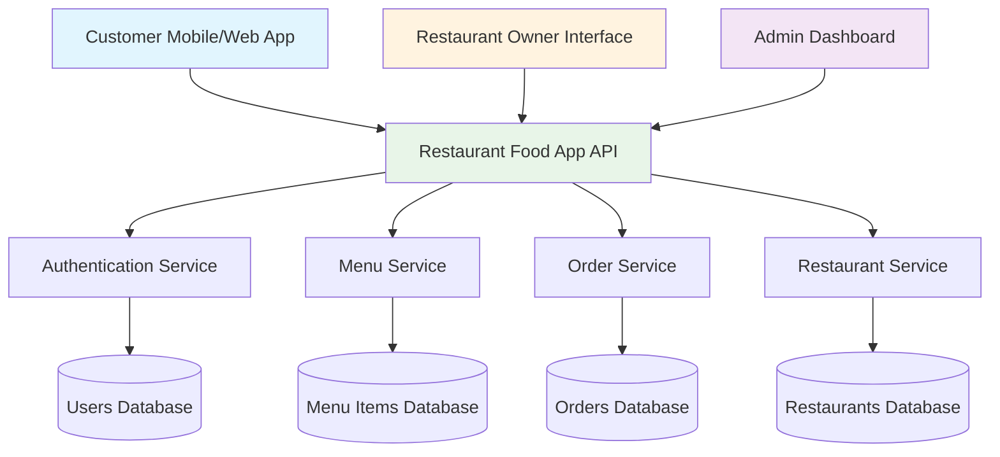
```mermaid
graph TB
    A[Customer Mobile/Web App] --> B[Restaurant Food App API]
    C[Restaurant Owner Interface] --> B
    D[Admin Dashboard] --> B
    
    B --> E[Authentication Service]
    B --> F[Menu Service]
    B --> G[Order Service]
    B --> H[Restaurant Service]
    
    E --> I[(Users Database)]
    F --> J[(Menu Items Database)]
    G --> K[(Orders Database)]
    H --> L[(Restaurants Database)]
    
    style A fill:#e1f5fe
    style C fill:#fff3e0
    style D fill:#f3e5f5
    style B fill:#e8f5e8
```

### User Role Interactions

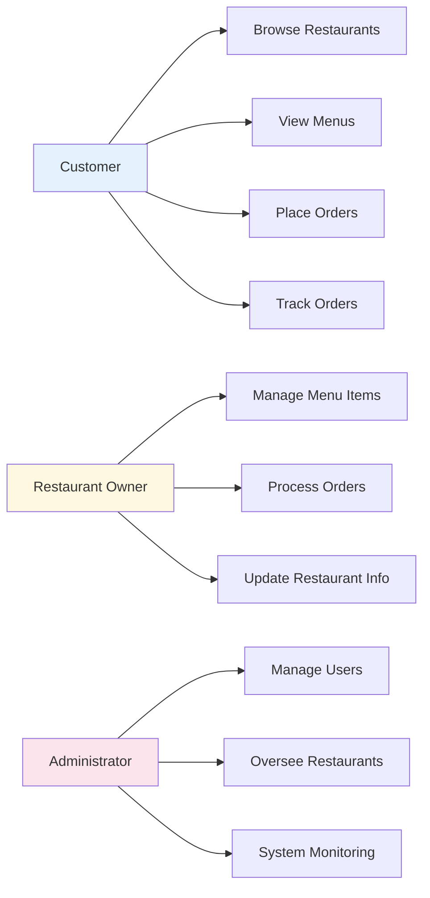
```mermaid
graph LR
    A[Customer] --> B[Browse Restaurants]
    A --> C[View Menus]
    A --> D[Place Orders]
    A --> E[Track Orders]
    
    F[Restaurant Owner] --> G[Manage Menu Items]
    F --> H[Process Orders]
    F --> I[Update Restaurant Info]
    
    J[Administrator] --> K[Manage Users]
    J --> L[Oversee Restaurants]
    J --> M[System Monitoring]
    
    style A fill:#e3f2fd
    style F fill:#fff8e1
    style J fill:#fce4ec
```

## Getting Started

### System Requirements
- Node.js installed on your system
- MongoDB database connection
- Web browser (Chrome, Firefox, Safari, or Edge)
- Internet connection

### Understanding the App Structure
The app consists of:
- **Backend API**: Handles all data processing and business logic
- **Database**: Stores user data, restaurant info, menus, and orders
- **Authentication System**: Manages user login and security

## User Authentication

### Authentication Flow

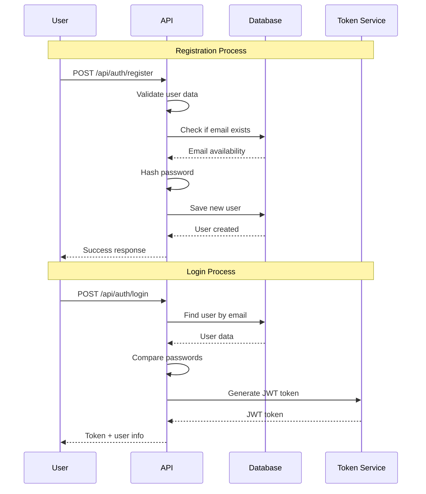
```mermaid
sequenceDiagram
    participant U as User
    participant A as API
    participant D as Database
    participant T as Token Service
    
    Note over U,T: Registration Process
    U->>A: POST /api/auth/register
    A->>A: Validate user data
    A->>D: Check if email exists
    D-->>A: Email availability
    A->>A: Hash password
    A->>D: Save new user
    D-->>A: User created
    A-->>U: Success response
    
    Note over U,T: Login Process
    U->>A: POST /api/auth/login
    A->>D: Find user by email
    D-->>A: User data
    A->>A: Compare passwords
    A->>T: Generate JWT token
    T-->>A: JWT token
    A-->>U: Token + user info
```

### Creating a New Account (Registration)

**Step 1: Access Registration**
- Navigate to the registration endpoint
- The system will ask for your personal information

**Step 2: Fill Required Information**
```json
{
  "name": "Your Full Name",
  "email": "your.email@example.com",
  "password": "SecurePassword123",
  "phone": "1234567890",
  "address": "Your complete address"
}
```

**Step 3: What Happens Next**
- The system creates your account
- Your password gets encrypted for security
- You receive a success confirmation
- You can now log in with your credentials

**Important Notes for Beginners:**
- Use a strong password (mix of letters, numbers, symbols)
- Your email must be unique - no duplicate accounts allowed
- Keep your login credentials safe

### Password Security Process

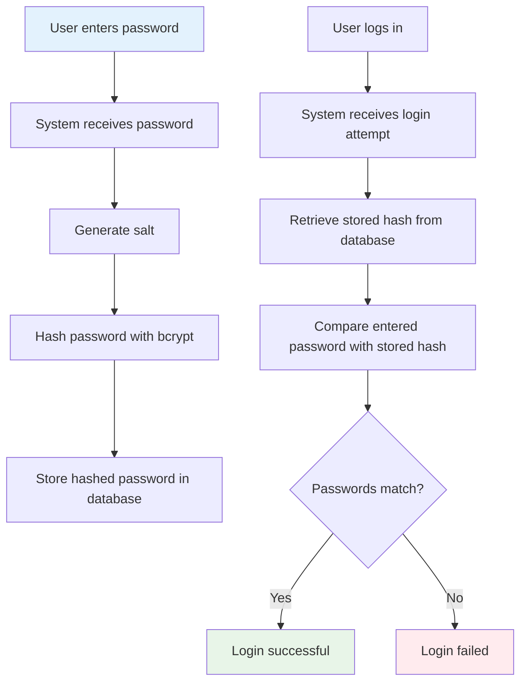
```mermaid
flowchart TD
    A[User enters password] --> B[System receives password]
    B --> C[Generate salt]
    C --> D[Hash password with bcrypt]
    D --> E[Store hashed password in database]
    
    F[User logs in] --> G[System receives login attempt]
    G --> H[Retrieve stored hash from database]
    H --> I[Compare entered password with stored hash]
    I --> J{Passwords match?}
    J -->|Yes| K[Login successful]
    J -->|No| L[Login failed]
    
    style A fill:#e3f2fd
    style K fill:#e8f5e8
    style L fill:#ffebee
```

### Logging Into Your Account

**Step 1: Prepare Your Credentials**
- Have your registered email address ready
- Remember your password

**Step 2: Send Login Request**
```json
{
  "email": "your.email@example.com",
  "password": "YourPassword123"
}
```

**Step 3: Receive Your Access Token**
- The system verifies your credentials
- You get a JWT (JSON Web Token) - think of it as your digital key
- This token proves you're logged in for future requests
- Token expires after some time for security

**What is a JWT Token?**
- It's like a digital ID card
- You need to include it in requests that require login
- It contains your user information securely encoded
- When it expires, you'll need to log in again

## Menu Management

### Menu Item Lifecycle

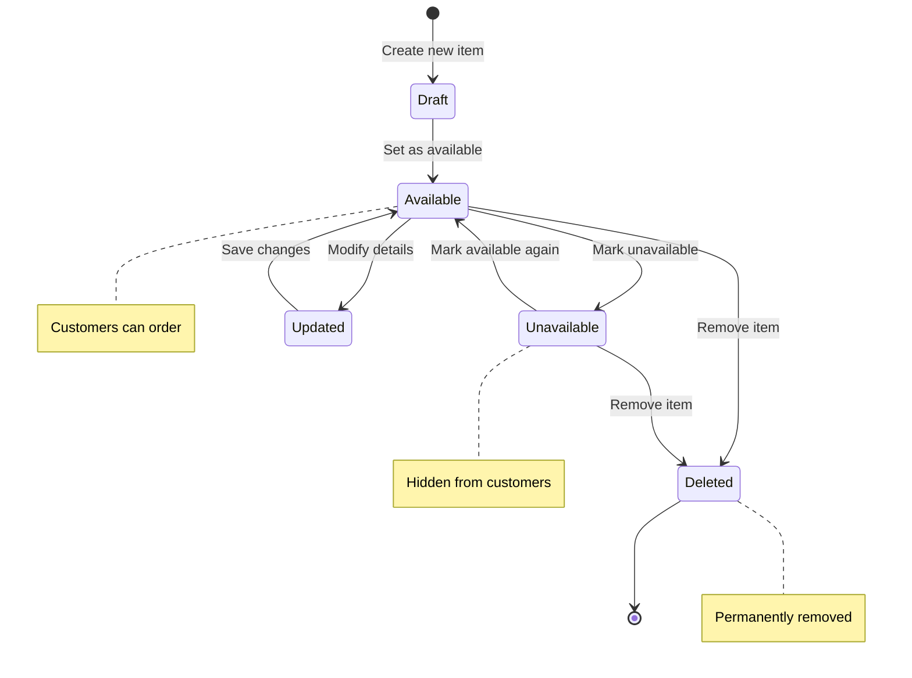
```mermaid
stateDiagram-v2
    [*] --> Draft: Create new item
    Draft --> Available: Set as available
    Available --> Unavailable: Mark unavailable
    Unavailable --> Available: Mark available again
    Available --> Updated: Modify details
    Updated --> Available: Save changes
    Available --> Deleted: Remove item
    Unavailable --> Deleted: Remove item
    Deleted --> [*]
    
    note right of Available: Customers can order
    note right of Unavailable: Hidden from customers
    note right of Deleted: Permanently removed
```

### Understanding Menu Structure

**What is a Menu Item?**
Every food item in the app has these details:
- **Name**: What the dish is called
- **Description**: Details about the dish
- **Price**: How much it costs
- **Category**: Type of food (appetizer, main course, dessert)
- **Image**: Picture of the dish
- **Availability**: Whether it's currently available
- **Restaurant**: Which restaurant serves it

### Menu Management Flow

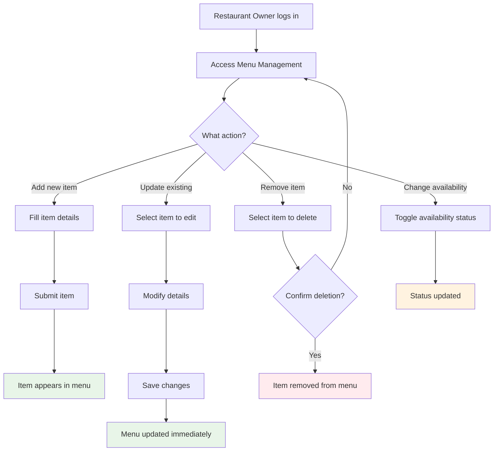
```mermaid
flowchart TD
    A[Restaurant Owner logs in] --> B[Access Menu Management]
    B --> C{What action?}
    
    C -->|Add new item| D[Fill item details]
    D --> E[Submit item]
    E --> F[Item appears in menu]
    
    C -->|Update existing| G[Select item to edit]
    G --> H[Modify details]
    H --> I[Save changes]
    I --> J[Menu updated immediately]
    
    C -->|Remove item| K[Select item to delete]
    K --> L{Confirm deletion?}
    L -->|Yes| M[Item removed from menu]
    L -->|No| B
    
    C -->|Change availability| N[Toggle availability status]
    N --> O[Status updated]
    
    style F fill:#e8f5e8
    style J fill:#e8f5e8
    style M fill:#ffebee
    style O fill:#fff3e0
```

### Adding a New Menu Item (For Restaurant Owners)

**Step 1: Prepare Your Item Information**
```json
{
  "name": "Margherita Pizza",
  "description": "Fresh tomato sauce, mozzarella cheese, and basil leaves",
  "price": 12.99,
  "category": "Pizza",
  "imageUrl": "https://example.com/pizza-image.jpg",
  "isAvailable": true,
  "restaurantId": "restaurant_id_here"
}
```

**Step 2: Understanding Each Field**
- **Name**: Keep it simple and appetizing
- **Description**: Help customers understand what they're ordering
- **Price**: Always use decimal format (12.99, not 13)
- **Category**: Helps customers find items easily
- **ImageUrl**: A link to an appetizing photo
- **isAvailable**: Set to false if temporarily out of stock
- **restaurantId**: Links the item to your restaurant

**Step 3: What Happens When You Add an Item**
- The system saves it to the database
- Customers can immediately see it in your menu
- You can edit or remove it later if needed

### Viewing Menu Items

**For Customers - Browsing Menus:**
1. **View All Items**: See everything available
2. **Filter by Restaurant**: See only items from specific restaurants
3. **Filter by Category**: Find appetizers, main courses, etc.
4. **Check Availability**: Only available items can be ordered

**For Restaurant Owners - Managing Your Menu:**
- View all your menu items
- See which items are popular
- Update prices or descriptions
- Mark items as unavailable temporarily

## Order Management

### Order Status Flow

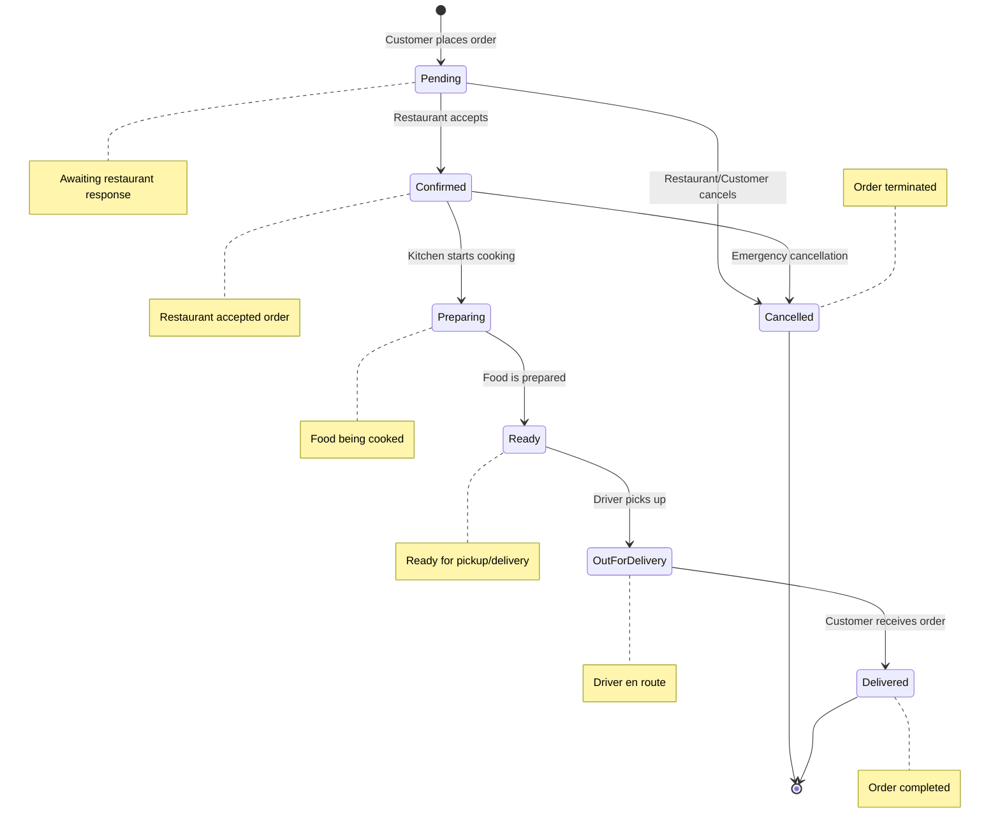
```mermaid
stateDiagram-v2
    [*] --> Pending: Customer places order
    Pending --> Confirmed: Restaurant accepts
    Pending --> Cancelled: Restaurant/Customer cancels
    Confirmed --> Preparing: Kitchen starts cooking
    Confirmed --> Cancelled: Emergency cancellation
    Preparing --> Ready: Food is prepared
    Ready --> OutForDelivery: Driver picks up
    OutForDelivery --> Delivered: Customer receives order
    Cancelled --> [*]
    Delivered --> [*]
    
    note right of Pending: Awaiting restaurant response
    note right of Confirmed: Restaurant accepted order
    note right of Preparing: Food being cooked
    note right of Ready: Ready for pickup/delivery
    note right of OutForDelivery: Driver en route
    note right of Delivered: Order completed
    note left of Cancelled: Order terminated
```

### Complete Order Process

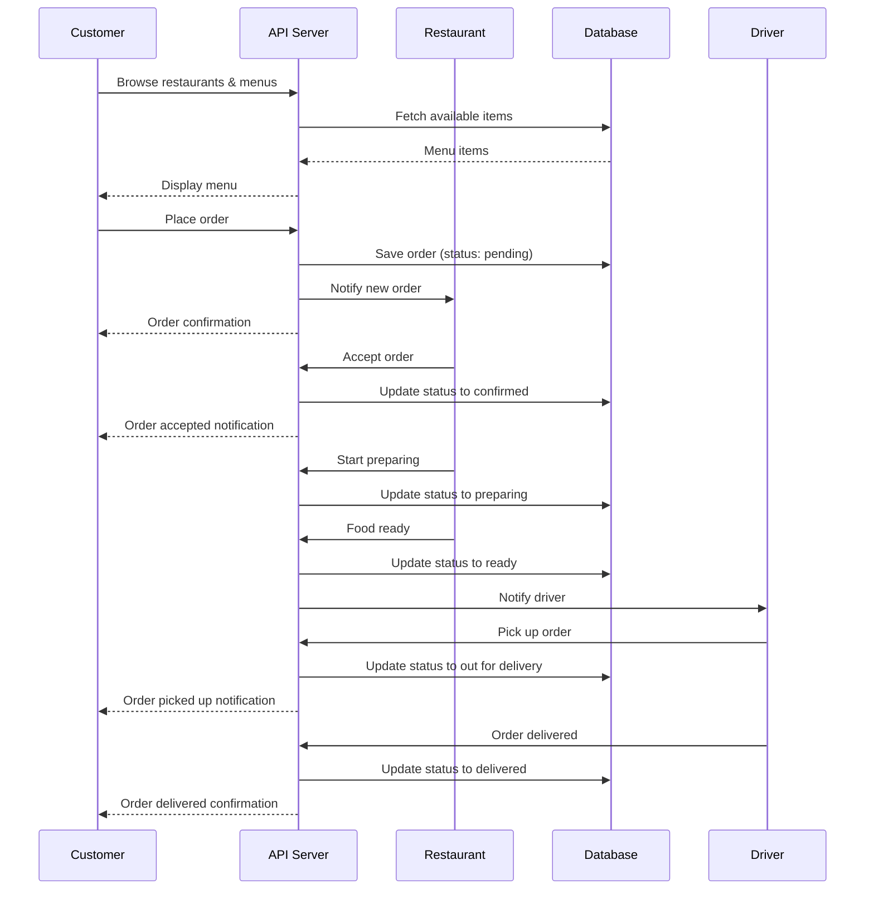
```mermaid
sequenceDiagram
    participant C as Customer
    participant API as API Server
    participant R as Restaurant
    participant DB as Database
    participant D as Driver
    
    C->>API: Browse restaurants & menus
    API->>DB: Fetch available items
    DB-->>API: Menu items
    API-->>C: Display menu
    
    C->>API: Place order
    API->>DB: Save order (status: pending)
    API->>R: Notify new order
    API-->>C: Order confirmation
    
    R->>API: Accept order
    API->>DB: Update status to confirmed
    API-->>C: Order accepted notification
    
    R->>API: Start preparing
    API->>DB: Update status to preparing
    
    R->>API: Food ready
    API->>DB: Update status to ready
    API->>D: Notify driver
    
    D->>API: Pick up order
    API->>DB: Update status to out for delivery
    API-->>C: Order picked up notification
    
    D->>API: Order delivered
    API->>DB: Update status to delivered
    API-->>C: Order delivered confirmation
```

### Understanding Orders

**What is an Order?**
An order contains:
- **Customer Information**: Who placed the order
- **Items Ordered**: What food items and quantities
- **Total Amount**: How much the order costs
- **Status**: Current stage of the order
- **Timestamps**: When it was placed, updated, etc.

### Order Status Explained for Beginners

1. **Pending**: Just placed, waiting for restaurant confirmation
2. **Confirmed**: Restaurant accepted and is preparing
3. **Preparing**: Food is being cooked
4. **Ready**: Food is ready for pickup/delivery
5. **Out for Delivery**: Driver has picked up the order
6. **Delivered**: Customer has received the order
7. **Cancelled**: Order was cancelled for some reason

### Placing an Order (For Customers)

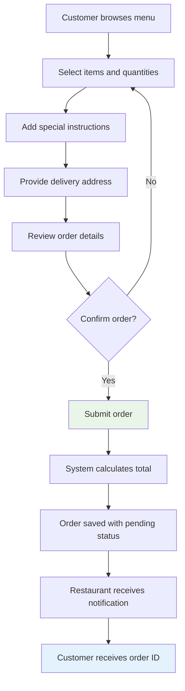
```mermaid
flowchart TD
    A[Customer browses menu] --> B[Select items and quantities]
    B --> C[Add special instructions]
    C --> D[Provide delivery address]
    D --> E[Review order details]
    E --> F{Confirm order?}
    F -->|Yes| G[Submit order]
    F -->|No| B
    G --> H[System calculates total]
    H --> I[Order saved with pending status]
    I --> J[Restaurant receives notification]
    J --> K[Customer receives order ID]
    
    style G fill:#e8f5e8
    style K fill:#e3f2fd
```

**Step 1: Choose Your Items**
```json
{
  "customerId": "your_user_id",
  "restaurantId": "restaurant_id",
  "items": [
    {
      "menuItemId": "item_id_1",
      "quantity": 2,
      "specialInstructions": "Extra spicy please"
    },
    {
      "menuItemId": "item_id_2", 
      "quantity": 1,
      "specialInstructions": "No onions"
    }
  ],
  "deliveryAddress": "Your complete delivery address"
}
```

**Step 2: Understanding Order Details**
- **customerId**: Your unique user identifier
- **restaurantId**: Which restaurant you're ordering from
- **items**: Array of what you want to order
- **quantity**: How many of each item
- **specialInstructions**: Any custom requests
- **deliveryAddress**: Where you want the food delivered

**Step 3: What Happens After You Place Order**
1. System calculates total price automatically
2. Order gets assigned a unique ID
3. Restaurant receives notification
4. You can track the order status
5. Payment processing begins

### Order Cancellation Rules

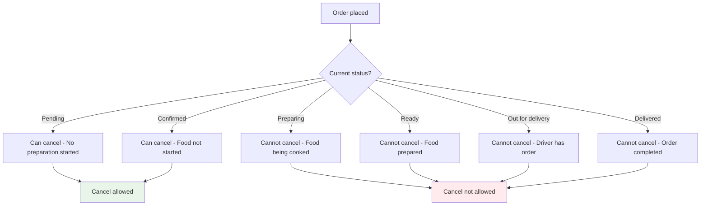
```mermaid
flowchart TD
    A[Order placed] --> B{Current status?}
    B -->|Pending| C[Can cancel - No preparation started]
    B -->|Confirmed| D[Can cancel - Food not started]
    B -->|Preparing| E[Cannot cancel - Food being cooked]
    B -->|Ready| F[Cannot cancel - Food prepared]
    B -->|Out for delivery| G[Cannot cancel - Driver has order]
    B -->|Delivered| H[Cannot cancel - Order completed]
    
    C --> I[Cancel allowed]
    D --> I
    E --> J[Cancel not allowed]
    F --> J
    G --> J
    H --> J
    
    style I fill:#e8f5e8
    style J fill:#ffebee
```

## Restaurant Management

### Restaurant Profile Structure

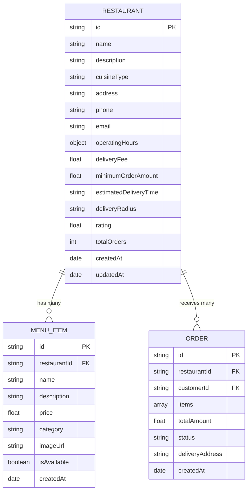
```mermaid
erDiagram
    RESTAURANT {
        string id PK
        string name
        string description
        string cuisineType
        string address
        string phone
        string email
        object operatingHours
        float deliveryFee
        float minimumOrderAmount
        string estimatedDeliveryTime
        string deliveryRadius
        float rating
        int totalOrders
        date createdAt
        date updatedAt
    }
    
    MENU_ITEM {
        string id PK
        string restaurantId FK
        string name
        string description
        float price
        string category
        string imageUrl
        boolean isAvailable
        date createdAt
    }
    
    ORDER {
        string id PK
        string restaurantId FK
        string customerId FK
        array items
        float totalAmount
        string status
        string deliveryAddress
        date createdAt
    }
    
    RESTAURANT ||--o{ MENU_ITEM : "has many"
    RESTAURANT ||--o{ ORDER : "receives many"
```

### Restaurant Onboarding Process

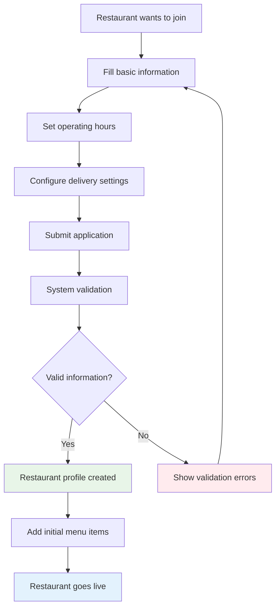
```mermaid
flowchart TD
    A[Restaurant wants to join] --> B[Fill basic information]
    B --> C[Set operating hours]
    C --> D[Configure delivery settings]
    D --> E[Submit application]
    E --> F[System validation]
    F --> G{Valid information?}
    G -->|Yes| H[Restaurant profile created]
    G -->|No| I[Show validation errors]
    I --> B
    H --> J[Add initial menu items]
    J --> K[Restaurant goes live]
    
    style H fill:#e8f5e8
    style I fill:#ffebee
    style K fill:#e3f2fd
```

### Understanding Restaurant Profiles

**What Makes a Restaurant Profile:**
- **Basic Information**: Name, description, cuisine type
- **Contact Details**: Phone, email, address
- **Operating Hours**: When the restaurant is open
- **Delivery Areas**: Where they deliver food
- **Rating System**: Customer reviews and ratings
- **Menu Association**: All their food items

### Adding a New Restaurant

**Step 1: Basic Information Setup**
```json
{
  "name": "Mario's Italian Kitchen",
  "description": "Authentic Italian cuisine with fresh ingredients",
  "cuisineType": "Italian",
  "address": "123 Main Street, Downtown",
  "phone": "555-0123",
  "email": "info@marios.com"
}
```

**Step 2: Operating Hours**
```json
{
  "operatingHours": {
    "monday": { "open": "11:00", "close": "22:00" },
    "tuesday": { "open": "11:00", "close": "22:00" },
    "wednesday": { "open": "11:00", "close": "22:00" },
    "thursday": { "open": "11:00", "close": "22:00" },
    "friday": { "open": "11:00", "close": "23:00" },
    "saturday": { "open": "11:00", "close": "23:00" },
    "sunday": { "open": "12:00", "close": "21:00" }
  }
}
```

**Step 3: Delivery Information**
```json
{
  "deliveryFee": 2.99,
  "minimumOrderAmount": 15.00,
  "estimatedDeliveryTime": "30-45 minutes",
  "deliveryRadius": "5 miles"
}
```

## API Usage Guide

### API Request/Response Flow

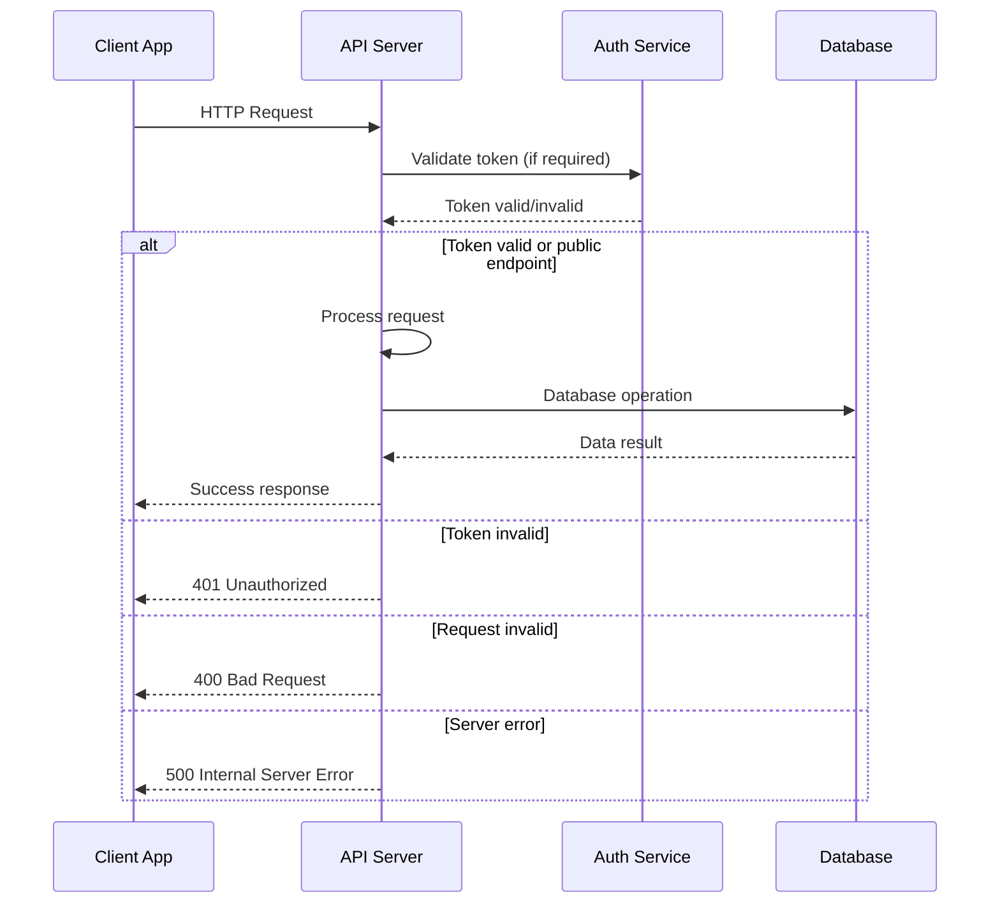
```mermaid
sequenceDiagram
    participant Client as Client App
    participant API as API Server
    participant Auth as Auth Service
    participant DB as Database
    
    Client->>API: HTTP Request
    API->>Auth: Validate token (if required)
    Auth-->>API: Token valid/invalid
    
    alt Token valid or public endpoint
        API->>API: Process request
        API->>DB: Database operation
        DB-->>API: Data result
        API-->>Client: Success response
    else Token invalid
        API-->>Client: 401 Unauthorized
    else Request invalid
        API-->>Client: 400 Bad Request
    else Server error
        API-->>Client: 500 Internal Server Error
    end
```

### Understanding APIs for Beginners

**What is an API?**
- API stands for Application Programming Interface
- Think of it as a waiter in a restaurant
- You (the customer) tell the waiter (API) what you want
- The waiter takes your request to the kitchen (database)
- The kitchen prepares your order and sends it back through the waiter

### API Endpoints Overview

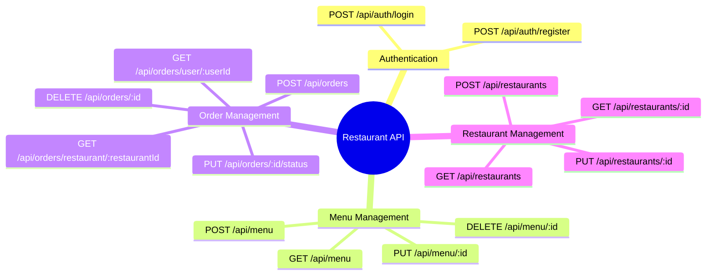
```mermaid
mindmap
  root((Restaurant API))
    Authentication
      POST /api/auth/register
      POST /api/auth/login
    Menu Management
      GET /api/menu
      POST /api/menu
      PUT /api/menu/:id
      DELETE /api/menu/:id
    Order Management
      POST /api/orders
      GET /api/orders/user/:userId
      GET /api/orders/restaurant/:restaurantId
      PUT /api/orders/:id/status
      DELETE /api/orders/:id
    Restaurant Management
      GET /api/restaurants
      POST /api/restaurants
      PUT /api/restaurants/:id
      GET /api/restaurants/:id
```

**How This Restaurant App API Works:**
- You send requests to specific web addresses (endpoints)
- Each endpoint does a specific job
- You get responses back with the information you requested
- Some endpoints require you to be logged in (authentication)

### Authentication Endpoints

**Registration Endpoint**
```
POST /api/auth/register
```
**What it does**: Creates a new user account
**Who can use it**: Anyone (public endpoint)
**What to send**: Name, email, password, phone, address
**What you get back**: Success message and user information

**Login Endpoint**  
```
POST /api/auth/login
```
**What it does**: Logs you into your account
**Who can use it**: Anyone with valid credentials
**What to send**: Email and password
**What you get back**: JWT token for future requests

### Menu Endpoints

**Get All Menu Items**
```
GET /api/menu
```
**Add New Menu Item**
```
POST /api/menu
```
**Update Menu Item**
```
PUT /api/menu/:id
```
**Delete Menu Item**
```
DELETE /api/menu/:id
```

### Order Endpoints

**Place New Order**
```
POST /api/orders
```
**Get User's Orders**
```
GET /api/orders/user/:userId
```
**Get Restaurant's Orders**
```
GET /api/orders/restaurant/:restaurantId
```
**Update Order Status**
```
PUT /api/orders/:id/status
```
**Cancel Order**
```
DELETE /api/orders/:id
```

### Restaurant Endpoints

**Get All Restaurants**
```
GET /api/restaurants
```
**Add New Restaurant**
```
POST /api/restaurants
```
**Update Restaurant**
```
PUT /api/restaurants/:id
```

## Database Operations

### Database Schema Relationships

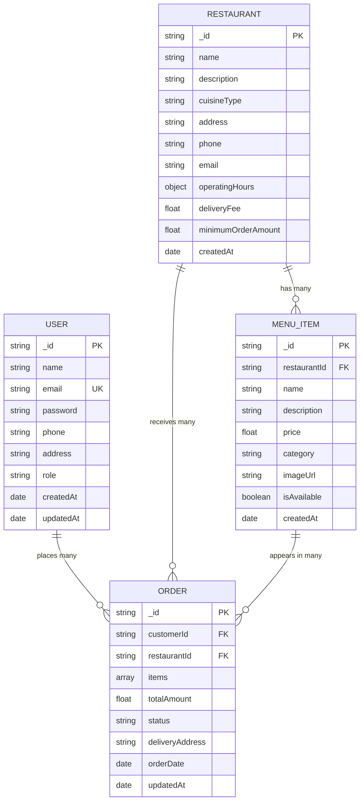
```mermaid
erDiagram
    USER {
        string _id PK
        string name
        string email UK
        string password
        string phone
        string address
        string role
        date createdAt
        date updatedAt
    }
    
    RESTAURANT {
        string _id PK
        string name
        string description
        string cuisineType
        string address
        string phone
        string email
        object operatingHours
        float deliveryFee
        float minimumOrderAmount
        date createdAt
    }
    
    MENU_ITEM {
        string _id PK
        string restaurantId FK
        string name
        string description
        float price
        string category
        string imageUrl
        boolean isAvailable
        date createdAt
    }
    
    ORDER {
        string _id PK
        string customerId FK
        string restaurantId FK
        array items
        float totalAmount
        string status
        string deliveryAddress
        date orderDate
        date updatedAt
    }
    
    USER ||--o{ ORDER : "places many"
    RESTAURANT ||--o{ MENU_ITEM : "has many"
    RESTAURANT ||--o{ ORDER : "receives many"
    MENU_ITEM ||--o{ ORDER : "appears in many"
```

### Data Flow Architecture

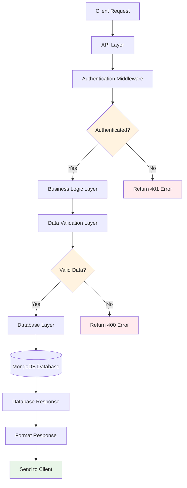
```mermaid
flowchart TB
    A[Client Request] --> B[API Layer]
    B --> C[Authentication Middleware]
    C --> D{Authenticated?}
    D -->|Yes| E[Business Logic Layer]
    D -->|No| F[Return 401 Error]
    E --> G[Data Validation Layer]
    G --> H{Valid Data?}
    H -->|Yes| I[Database Layer]
    H -->|No| J[Return 400 Error]
    I --> K[(MongoDB Database)]
    K --> L[Database Response]
    L --> M[Format Response]
    M --> N[Send to Client]
    
    style D fill:#fff3e0
    style H fill:#fff3e0
    style F fill:#ffebee
    style J fill:#ffebee
    style N fill:#e8f5e8
```

### Understanding the Database Structure

**For Beginners - What is a Database?**
- Think of it as a digital filing cabinet
- It stores all information about users, restaurants, menus, and orders
- Data is organized in "collections" (like folders)
- Each collection contains "documents" (like individual files)

**Main Collections in Our App:**

1. **Users Collection**
   - Stores customer and restaurant owner accounts
   - Contains names, emails, encrypted passwords, addresses
   - Each user has a unique ID

2. **Restaurants Collection**
   - Stores restaurant profiles and information
   - Contains names, addresses, operating hours, contact info
   - Each restaurant has a unique ID

3. **Menu Items Collection**
   - Stores all food items available for order
   - Contains names, descriptions, prices, categories
   - Links to specific restaurants

4. **Orders Collection**
   - Stores all customer orders
   - Contains items ordered, quantities, total prices, status
   - Links customers to restaurants and menu items

## Error Handling

### Error Response Flow

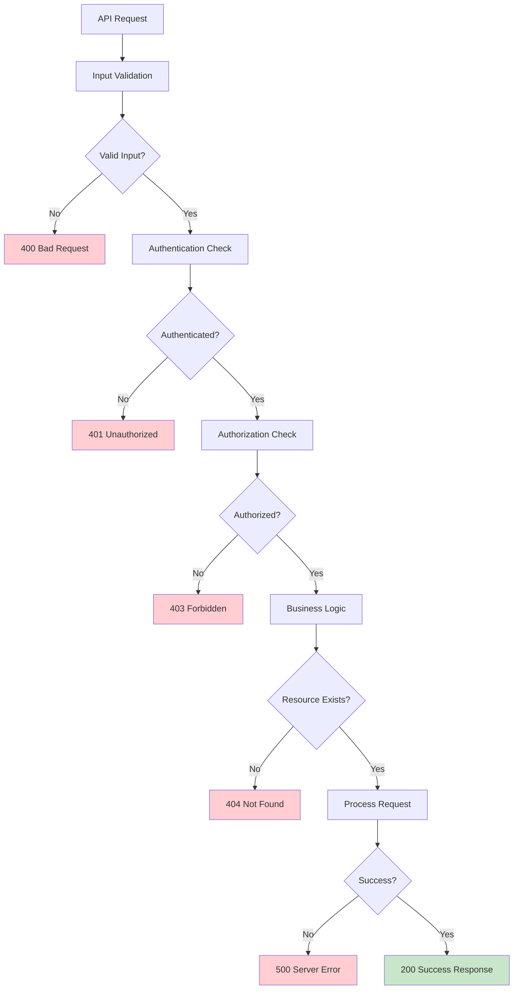
```mermaid
flowchart TD
    A[API Request] --> B[Input Validation]
    B --> C{Valid Input?}
    C -->|No| D[400 Bad Request]
    C -->|Yes| E[Authentication Check]
    E --> F{Authenticated?}
    F -->|No| G[401 Unauthorized]
    F -->|Yes| H[Authorization Check]
    H --> I{Authorized?}
    I -->|No| J[403 Forbidden]
    I -->|Yes| K[Business Logic]
    K --> L{Resource Exists?}
    L -->|No| M[404 Not Found]
    L -->|Yes| N[Process Request]
    N --> O{Success?}
    O -->|No| P[500 Server Error]
    O -->|Yes| Q[200 Success Response]
    
    style D fill:#ffcdd2
    style G fill:#ffcdd2
    style J fill:#ffcdd2
    style M fill:#ffcdd2
    style P fill:#ffcdd2
    style Q fill:#c8e6c9
```

### Common HTTP Status Codes

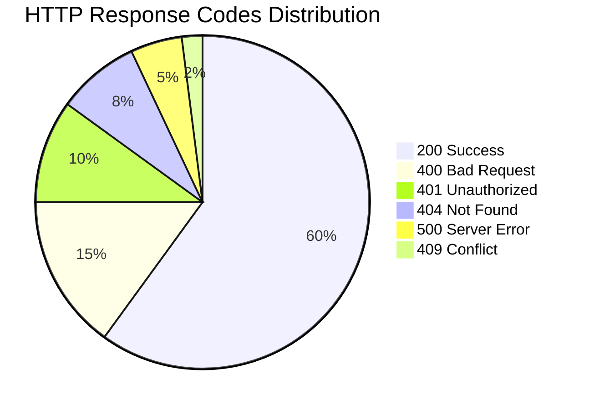
```mermaid
pie title HTTP Response Codes Distribution
    "200 Success" : 60
    "400 Bad Request" : 15
    "401 Unauthorized" : 10
    "404 Not Found" : 8
    "500 Server Error" : 5
    "409 Conflict" : 2
```

### Understanding Error Messages

**For Beginners - Why Errors Happen:**
- Missing required information
- Invalid data formats
- Network connectivity issues
- Authentication problems
- Server processing issues

### Common Error Types and Solutions

**400 - Bad Request**
**What it means**: The information you sent is incorrect or incomplete

**401 - Unauthorized**  
**What it means**: You need to log in or your login has expired

**404 - Not Found**
**What it means**: The item you're looking for doesn't exist

**409 - Conflict**
**What it means**: There's a conflict with existing data

**500 - Internal Server Error**
**What it means**: Something went wrong on the server

## Troubleshooting

### Troubleshooting Decision Tree

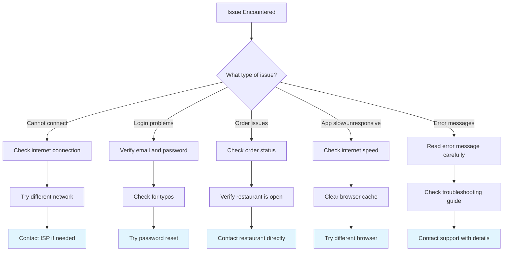
```mermaid
flowchart TD
    A[Issue Encountered] --> B{What type of issue?}
    
    B -->|Cannot connect| C[Check internet connection]
    C --> D[Try different network]
    D --> E[Contact ISP if needed]
    
    B -->|Login problems| F[Verify email and password]
    F --> G[Check for typos]
    G --> H[Try password reset]
    
    B -->|Order issues| I[Check order status]
    I --> J[Verify restaurant is open]
    J --> K[Contact restaurant directly]
    
    B -->|App slow/unresponsive| L[Check internet speed]
    L --> M[Clear browser cache]
    M --> N[Try different browser]
    
    B -->|Error messages| O[Read error message carefully]
    O --> P[Check troubleshooting guide]
    P --> Q[Contact support with details]
    
    style E fill:#e1f5fe
    style H fill:#e1f5fe
    style K fill:#e1f5fe
    style N fill:#e1f5fe
    style Q fill:#e1f5fe
```

### Performance Optimization Tips

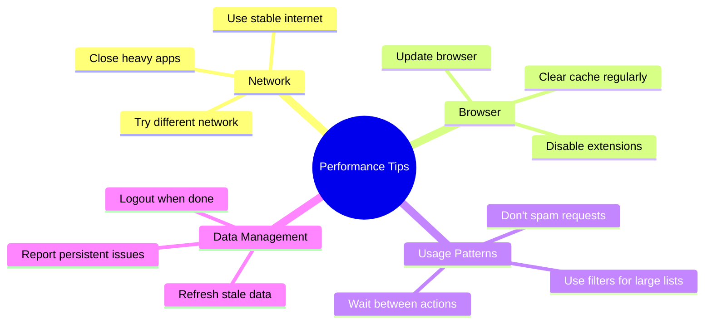
```mermaid
mindmap
  root((Performance Tips))
    Network
      Use stable internet
      Close heavy apps
      Try different network
    Browser
      Clear cache regularly
      Update browser
      Disable extensions
    Usage Patterns
      Don't spam requests
      Wait between actions
      Use filters for large lists
    Data Management
      Logout when done
      Refresh stale data
      Report persistent issues
```

## FAQ

### Frequently Asked Questions by Category

```mermaid
mindmap
  root((FAQ Categories))
    General
      App pricing
      Security measures
      Mobile compatibility
      Password recovery
    Account Management
      Email changes
      Multiple accounts
      Profile updates
      Data correction
    Restaurant Operations
      Partnership process
      Multiple locations
      Order notifications
      Menu updates
    Ordering Process
      Order modifications
      Cancellation policies
      Status tracking
      Delivery times
    Technical Support
      Technology stack
      API integration
      Rate limiting
      Bug reporting
```

### General Questions

**Q: Is this app free to use?**
A: The basic app functionality is free for customers. Restaurants may have subscription fees or commission charges depending on the business model.

**Q: How secure is my personal information?**
A: Very secure. We use industry-standard encryption for passwords, secure tokens for authentication, and follow data protection best practices.

**Q: Can I use this app on my mobile phone?**
A: This is a backend API system. To use it on mobile, you would need a mobile app that connects to these APIs, or a mobile-responsive web interface.

**Q: What happens if I forget my password?**
A: Currently, the system doesn't include password reset functionality. You would need to contact support or register a new account with a different email.

### Quick Reference Guide

```mermaid
flowchart LR
    A[Quick Help] --> B{Problem Type}
    
    B -->|Login Issues| C[Check email/password → Clear cache → Contact support]
    B -->|Order Problems| D[Verify login → Check restaurant hours → Contact restaurant]
    B -->|Slow Performance| E[Check internet → Refresh page → Wait and retry]
    B -->|Error Messages| F[Read message → Check guide → Report with details]
    
    style C fill:#e8f5e8
    style D fill:#fff3e0
    style E fill:#e3f2fd
    style F fill:#fce4ec
```

---

**Need More Help?**

If this guide doesn't answer your questions:
- Contact technical support with specific details about your issue
- Include any error messages you're seeing
- Describe what you were trying to do when the problem occurred
- Mention what device and browser you're using (if applicable)

**Guide Last Updated**: August 17, 2025

*This guide covers the core functionality of the Restaurant Food App API. Additional features may be added over time.*